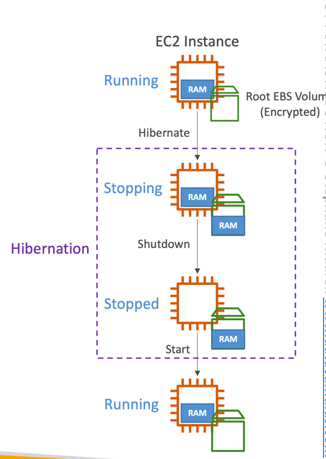

### EC2 = Elastic Compute Cloud = Infrastructure as a Service

---

#### EC2 - Common info

- it mainly consists in the capability of:
  - renting virtual machines (EC2) (called EC2 instances)
  - storing data on virtual drivers (EBS)
  - distributing load across machines (ELB - Elastic Load Balancer)
  - scaling the services using an auto-scaling group (ASG)
- knowing EC2 is fundamental to understand how the Cloud works

--- 

#### EC2: Sizing & Configuration Options

In EC2-instance we have opportunity to launch instance with very flexible configurations. For example, we can:

- chose operation system (OS): Linux, Windows or Mac OS
- how much **compute power** & **cores** (CPU)
- how much **random-access memory** (RAM)
- how much storage space:
    - network-attached (EBS & EFS)
    - hardware (EC2 Instance Store)
- network card: speed of the card, Public IP address
- firewall rules: **security group**
- bootstrap script (configure at first launch): EC2 User Data
- etc.

---

#### EC2 User Data 

User Data - is a place where we can write a script that will execute in the first set up of the instance. This process called
**bootstrapping**

- it is possible to bootstrap our instances using an EC2 User data script.
- bootstrapping means launching commands when a machine starts
- that script is only runs once at the instance first start
- it is possible to bootstrap our instances using an **EC2 User Data** script
- the EC2 User Data has a very specific purpose. It is to automate boot tasks, hence the name bootstrapping. We can automate boot task such as:
    - installing updates
    - installing software
    - download common files from the internet
    - etc
- the EC2 User Data Script runs with the root user (means with sudo rights)

---

#### EC2: Private vs Public IP (IPv4)

- Networking has two sorts of IPs. IPv4 and IPv6:
  - IPv4: 1.160.10.240
  - IPv6: 3ffe:1900:4545:3:200:f8ff:fe21:67cf
- IPv4 is still the most common format used online.
- IPv6 is newer and solves problems for the Internet of Things (IoT).
- IPv4 allows for 3.7 billion different addresses in the public space
- IPv4: [0-255].[0-255].[0-255].[0-255].

- Public IP:
  - Public IP means the machine can be identified on the internet (WWW)
  - Must be unique across the whole web (not two machines can have the same public IP).
  - Can be geo-located easily

- Private IP:
  - Private IP means the machine can only be identified on a private network only
  - The IP must be unique across the private network
  - BUT two different private networks (two companies) can have the same IPs.
  - Machines connect to WWW using a NAT + internet gateway (a proxy)
  - Only a specified range of IPs can be used as private IP

- Elastic IPs
  - When you stop and then start an EC2 instance, it can change its public IP.
  - If you need to have a fixed public IP for your instance, you need an Elastic IP
  - An Elastic IP is a public IPv4 IP you own as long as you don’t delete it
  - You can attach it to one instance at a time
  - With an Elastic IP address, you can mask the failure of an instance or software by rapidly remapping the address to another instance in your account.
  - You can only have 5 Elastic IP in your account (you can ask AWS to increase that).
  - Overall, try to avoid using Elastic IP:
    - They often reflect poor architectural decisions
    - Instead, use a random public IP and register a DNS name to it
    - Or use a Load Balancer and don’t use a public IP

---

#### EC2: Elastic Network Interface (ENI)

- logic component in VPC that represents a **virtual network card** (it gives EC2 instances access to the network)
- the ENI can have the following attributes:
  - primary private IPv4, one or more secondary IPv4
  - one Elastic IP (IPv4) per private IPv4
  - one public IPv4
  - one or more security groups attached to ENI
  - MAC address
- you can create ENI independently and attach them on the fly (move them) on EC2 instances for failover
- bound to a specific availability zone (AZ)

---

#### EC2: Hibernate

- We know we can stop, terminate instances
  - **Stop** – the data on disk (EBS) is kept intact in the next start
  - **Terminate** – any EBS volumes (root) also set-up to be destroyed is lost

- On start, the following happens:
  - First start: the OS boots & the EC2 User Data script is run
  - Following starts: the OS boots up
  - Then your application starts, caches get warmed up, and that can take time!

- Introducing EC2 Hibernate:
  - The in-memory (RAM) state is preserved
  - The instance boot is much faster! (the OS is not stopped / restarted)
  - Under the hood: the RAM state is written to a file in the root EBS volume
  - The root EBS volume must be encrypted

- Use cases:
  - Long-running processing
  - Saving the RAM state
  - Services that take time to initialize

#### EC2: Hibernate. Good to know

- Supported Instance Families – C3, C4, C5, I3, M3, M4, R3, R4,T2,T3, ...
- Instance RAM Size – must be less than 150 GB.
- Instance Size – not supported for bare metal instances.
- AMI – Amazon Linux 2, Linux AMI, Ubuntu, RHEL, CentOS & Windows...
- Root Volume – must be EBS, encrypted, not instance store, and large
- Available for On-Demand, Reserved and Spot Instances
- An instance can NOT be hibernated more than 60 days

---