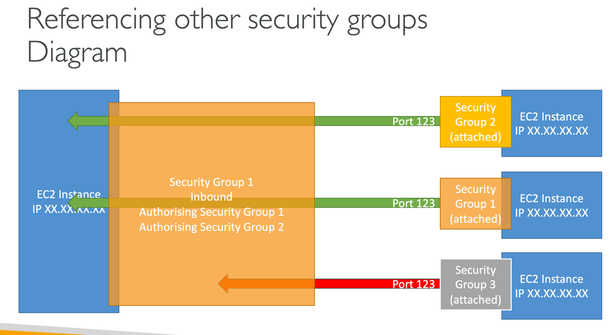

### EC2: Security Groups

- **security group** is a "virtual firewall"
- **security groups** are fundamental of the network security in AWS
- they control how traffic is allowed into or out of our EC2 instances
- **security groups** can contain only **allow** rules
- **security groups** rules can reference by IP or by other security group (**security groups** can reference each other)
- **security groups** are acting as a "firewall" on EC2 instances
- they regulate:
    - access to ports
    - authorized IP-ranges - IPv4, IPv6
    - control of inbound network (from other to the instance)
    - control of outbound network (from the instance to other)

---

#### Good to know about security groups

- can be attached to multiple instances (and of course instance can have multiple security groups too)
- locked down to a region / VPC combination (if you switch to another region or create another VPS group, you have to recreate security group)
- **security group** lives outside of the EC2 - if traffic is blocked the EC2 instance won't see it (it's not application running in EC2, it's really a firewall outside of EC2)
- it's good to maintain one separate security group for SSH access
- if your application is not accessible (time out), then it's **security group** issue
- if your application gives a "connection refused" error, then it's an application error or it's not launched
- by default, all inbound traffic is blocked
- by default, all outbound traffic is authorized 

---

---

#### Classic Ports to know

- 22 = SSH (Secure Shell) - log into a Linux instance
- 21 = FTP (File Transfer Protocol) – upload files into a file share
- 22 = SFTP (Secure File Transfer Protocol) – upload files using SSH
- 80 = HTTP – access unsecured websites
- 443 = HTTPS – access secured websites
- 3389 = RDP (Remote Desktop Protocol) – log into a Windows instance