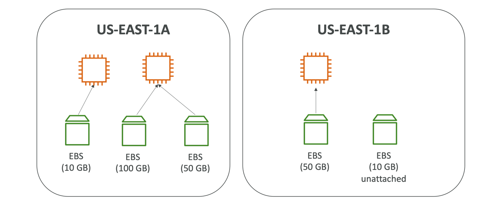
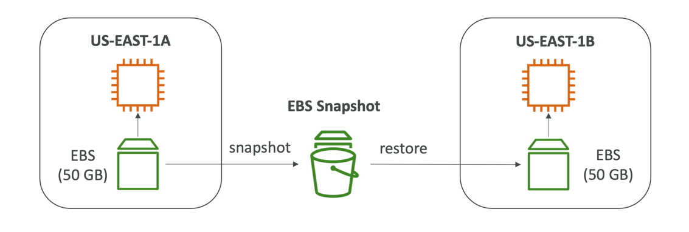
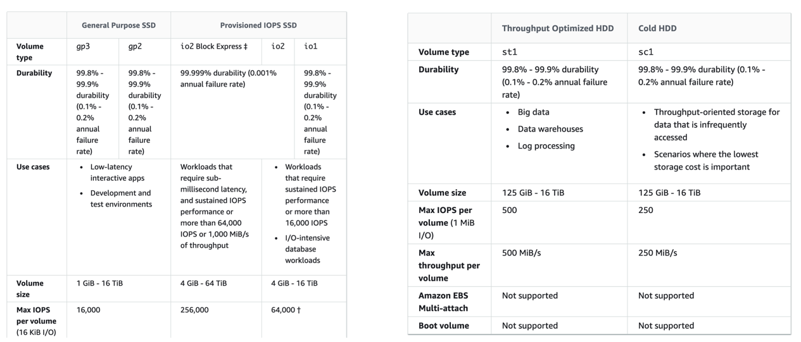

### EBS Volume

---

#### What’s an EBS Volume?

- An EBS (Elastic Block Store) Volume is a network drive you can attach to your instances while they run
- It allows your instances to persist data, even after their termination
- They can only be mounted to one instance at a time
- They are bound to a specific availability zone

---

#### EBS Volume

- It’s a network drive (i.e. not a physical drive)
    - It uses the network to communicate the instance, which means there might be a bit of latency
    - It can be detached from an EC2 instance and attached to another one quickly

- It’s locked to an Availability Zone (AZ)
    - An EBS Volume in **us-east-1a** cannot be attached to **us-east-1b**
    - To move a volume across AZ, you first need to snapshot it

- Have a provisioned capacity (size in GBs, and IOPS (Input/Output Operations Per Second))
    - You get billed for all the provisioned capacity
    - You can increase the capacity of the drive over time

In the picture above:
- EBS can be attached to one instance
- one instance can use multiple EBS
- EBS can be unattached

---

#### EBS – Delete on Termination attribute

- Controls the EBS behaviour when an EC2 instance terminates
    - By default, the root EBS volume is deleted (attribute enabled)
    - By default, any other attached EBS volume is not deleted (attribute disabled)
- This can be controlled by the AWS console / AWS CLI
- Use case: preserve root volume when instance is terminated

---

#### EBS Snapshots

- Make a backup (snapshot) of your EBS volume at a point in time
- Not necessary to detach volume to do snapshot, but recommended
- Can copy snapshots across AZ or Region

--- 

#### EBS Snapshots Features

- EBS Snapshot Archive:
    - Move a Snapshot to an ”archive tier” that is 75% cheaper
    - Takes within 24 to 72 hours for restoring the archive

- Recycle Bin for EBS Snapshots:
    - Setup rules to retain deleted snapshots so you can recover them after an accidental deletion
    - Specify retention (from 1 day to 1 year)

- Fast Snapshot Restore (FSR):
    - Force full initialization of snapshot to have no latency on the first use ($$$)

---

### EBS Volume Types

- EBS Volumes come in 6 types
  - gp2 / gp3 (SSD): General purpose SSD volume that balances price and performance for a wide variety of workloads
  - io1 / io2 (SSD): Highest-performance SSD volume for mission-critical low-latency or high-throughput workloads
  - st1 (HDD): Low cost HDD volume designed for frequently accessed, throughput- intensive workloads
  - sc1 (HDD): Lowest cost HDD volume designed for less frequently accessed workloads
- EBS Volumes are characterized in: Size | Throughput | IOPS (I/O Ops Per Sec)
- Only gp2/gp3 and io1/io2 can be used as boot volumes

#### General Purpose SSD (gp2 / gp3)

- Cost effective storage, low-latency
- System boot volumes,Virtual desktops, Development and test environments
- 1 GiB - 16TiB
- gp3:
  - Baseline of 3,000 IOPS and throughput of 125 MiB/s
  - Can increase IOPS up to 16,000 and throughput up to 1000 MiB/s independently
- gp2:
  - Small gp2 volumes can burst IOPS to 3,000
  - Size of the volume and IOPS are linked, max IOPS is 16,000
  - 3 IOPS per GB, means at 5,334 GB we are at the max IOPS

#### Provisioned IOPS (PIOPS) SSD (io1 / io2)

- Critical business applications with sustained IOPS performance
- Or applications that need more than 16,000 IOPS
- Great for databases workloads (sensitive to storage perf and consistency)
- io1/io2 (4 GiB - 16 TiB):
  - Max PIOPS: 64,000 for Nitro EC2 instances & 32,000 for other
  - Can increase PIOPS independently from storage size
  - io2 have more durability and more IOPS per GiB (at the same price as io1)
- io2 Block Express (4 GiB – 64 TiB):
  - Sub-millisecond latency
  - Max PIOPS: 256,000 with an IOPS:GiB ratio of 1,000:1
- Supports EBS Multi-attach

#### Hard Disk Drives (HDD)

- Cannot be a boot volume
- 125 GiB to 16TiB
- Throughput Optimized HDD (st1)
  - Big Data, Data Warehouses, Log Processing
  - Max throughput 500 MiB/s – max IOPS 500
- Cold HDD (sc1):
  - For data that is infrequently accessed
  - Scenarios where lowest cost is important
  - Max throughput 250 MiB/s – max IOPS 250

#### EBS – VolumeTypes Summary

---

#### EBS Multi-Attach – io1/io2 family

- Attach the same EBS volume to multiple EC2 instances in the same AZ
- Each instance has full read & write permissions to the high-performance volume
- Use case:
  - Achieve higher application availability in clustered Linux applications (ex:Teradata)
  - Applications must manage concurrent write operations
- Up to 16 EC2 Instances at a time
- Must use a file system that’s cluster-aware (not XFS, EXT4, etc...)

---

#### EBS Encryption

- When you create an encrypted EBS volume, you get the following:
  - Data at rest is encrypted inside the volume
  - All the data in flight moving between the instance and the volume is encrypted
  - All snapshots are encrypted
  - All volumes created from the snapshot
- Encryption and decryption are handled transparently (behind the scenes) (you have nothing to do)
- Encryption has a minimal impact on latency
- EBS Encryption leverages keys from KMS (AES-256)
- Copying an unencrypted snapshot allows encryption
- Snapshots of encrypted volumes are encrypted

---

#### Encryption: encrypt an unencrypted EBS volume

- Create an EBS snapshot of the volume
- Encrypt the EBS snapshot ( using copy )
- Create new ebs volume from the snapshot ( the volume will also be encrypted )
- Now you can attach the encrypted volume to the original instance