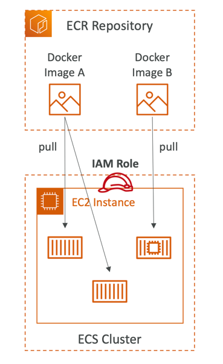

### ECR - Elastic Container Registry

It's analogy of DockerHub, but from AWS and this service has benefits of integrations of other AWS services. 

- **Container Image Registry**: ECR serves as a private repository for storing and managing Docker container images. It allows you to push, pull, and manage your container images securely within the AWS ecosystem.
- **Integration with ECS**: ECR seamlessly integrates with Amazon ECS, making it easy to store and deploy container images for ECS tasks and services. You can use ECR as a source for your ECS task definitions.
- **Secure and Private**: ECR repositories are private by default, and access to them is controlled by AWS Identity and Access Management (IAM) policies. This ensures that only authorized users and services can pull images from or push images to your repositories.
- **Image Lifecycle Policies**: ECR supports lifecycle policies, allowing you to automate the cleanup of old or unused container images. You can define rules to expire or delete images based on criteria such as age or number of images.
- **Cross-Region Replication**: ECR supports cross-region replication, enabling you to replicate container images between different AWS regions for redundancy and disaster recovery purposes.
- **Authentication with Docker CLI**: ECR supports Docker CLI authentication, making it easy to push and pull images from ECR repositories using familiar Docker commands.
- **Integration with Other AWS Services**: ECR can be used in conjunction with other AWS services like AWS CodeBuild, AWS CodePipeline, and AWS Lambda for building, testing, and deploying containerized applications.

---

- ECR = Elastic Container Registry
- Store and manage Docker images on AWS
- Private and Public repository
- Fully integrated with ECS
- Access is controlled through IAM (permission errors => policy)
- Supports image vulnerability scanning, versioning, image tags, image lifecycle, etc.

