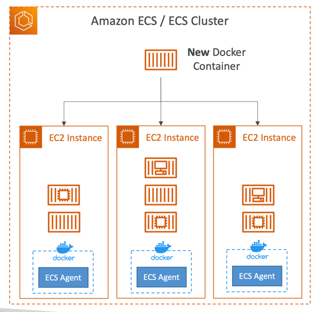
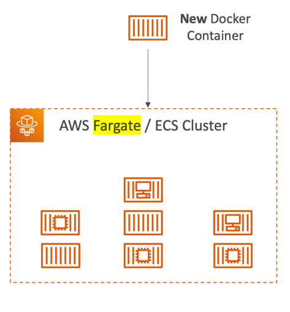
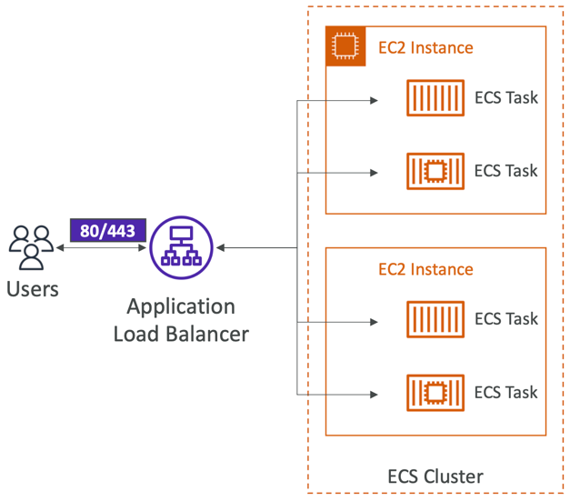
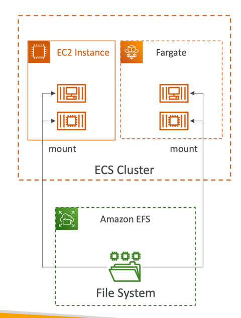
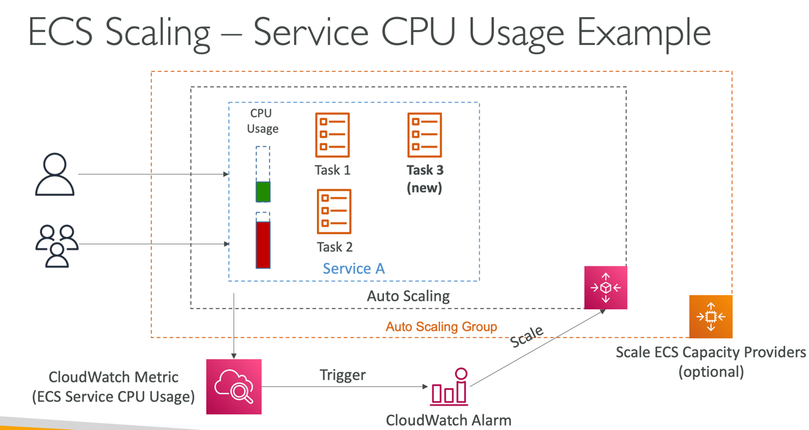

### ECS - Elastic Container Service

Amazon ECS, is a fully managed container orchestration service provided by AWS. It enables you to run, stop, and manage
Docker containers on a cluster. ECS simplifies the deployment, management, and scaling of containerized applications in
the AWS cloud.

Key features:

- **Containers and Docker**: Amazon ECS uses Docker containers to package applications and their dependencies. Containers provide a consistent environment, making it easier to develop, test, and deploy applications.
- **Clusters**: A cluster is a group of Amazon EC2 instances that host containerized applications. ECS manages the placement of tasks (groups of containers) on these instances.
- **Tasks and Services**: A task is the definition of a set of containers that run together on the same host. Services allow you to define and run long-running applications. A service ensures that a specified number of tasks are running and automatically replaces any that fail or become unhealthy.
- **Task Definition**: A task definition is a blueprint for your application. It specifies the containers in the task, the resources they require, and other configurations. Task definitions are used to run tasks or create services.
- **Scheduling**: ECS automatically places tasks on your cluster based on the resource requirements, constraints, and placement strategies you define. This allows for efficient resource utilization and high availability.
- **Integration with AWS Fargate**: AWS Fargate is a serverless compute engine for containers. ECS integrates with Fargate, allowing you to run containers without managing the underlying infrastructure. This simplifies the deployment process and enables you to focus on your applications

---

### Fargate

AWS Fargate is a serverless compute engine for containers provided by Amazon Web Services (AWS). Fargate allows you to
run containers without having to manage the underlying infrastructure. With Fargate, you can focus solely on designing and
deploying your containerized applications, while AWS takes care of the server provisioning, scaling, and management.

Key features:

- **Serverless Container Execution**: Fargate abstracts away the need to provision and manage virtual machines or servers. You only need to define and launch your containers, and AWS Fargate handles the rest, such as scaling, patching, and securing the infrastructure.
- **Resource Isolation**: Fargate provides resource isolation for containers, ensuring that each container has its own compute, memory, and networking resources. This isolation enhances security and performance.
- **Compatibility with ECS**: AWS Fargate seamlessly integrates with Amazon ECS, enabling you to use Fargate as a launch type when defining ECS tasks. This allows you to benefit from the orchestration capabilities of ECS without managing the underlying infrastructure.
- **Task and Service Definitions**: Just like ECS, Fargate uses task and service definitions to define and manage containerized applications. Task definitions specify the containers, resources, and configurations needed for an application, while services manage the desired state of tasks and handle scaling and availability.
- **Networking**: Fargate supports Amazon VPC (Virtual Private Cloud) networking, allowing you to place your containers in private or public subnets. It integrates with other AWS networking services to enable secure and scalable communication between containers.

---

#### Amazon ECS - EC2 Launch Type

- Launch Docker containers on AWS = Launch ECS Tasks on ECS Clusters
- EC2 Launch Type: you must provision & maintain the infrastructure (the EC2 instances)
- Each EC2 Instance must run the ECS Agent to register in the ECS Cluster
- AWS takes care of starting / stopping containers

#### Amazon ECS – Fargate LaunchType

- You do not provision the infrastructure (no EC2 instances to manage)
- It’s all Serverless!
- You just create task definitions
- AWS just runs ECSTasks for you based on the CPU / RAM you need
- To scale, just increase the number of tasks. Simple - no more EC2 instances

---

#### Amazon ECS – Load Balancer Integrations

- Application Load Balancer supported and works for most use cases
- Network Load Balancer recommended only for high throughput / high performance use cases, or to pair it with AWS Private Link
- Classic Load Balancer supported but not recommended (no advanced features – no Fargate)

--- 

#### Amazon ECS – Data Volumes (EFS)

- Mount EFS file systems onto ECS tasks
- Works for both EC2 and Fargate launch types
- Tasks running in any AZ will share the same data in the EFS file system
- Use cases: persistent multi-AZ shared storage for your containers
- Note:
  - Amazon S3 cannot be mounted as a file system

---

#### ECS Service Auto Scaling

- Automatically increase/decrease the desired number of ECS tasks
- Amazon ECS Auto Scaling uses AWS Application Auto Scaling
  - ECS Service Average CPU Utilization
  - ECS Service Average Memory Utilization - Scale on RAM
  - ALB Request Count Per Target – metric coming from the ALB

- Target Tracking – scale based on target value for a specific CloudWatch metric
- Step Scaling – scale based on a specified CloudWatch Alarm
- Scheduled Scaling – scale based on a specified date/time (predictable changes)
- Fargate Auto Scaling is much easier to setup (because Serverless)

Example of trigger ASG

---
