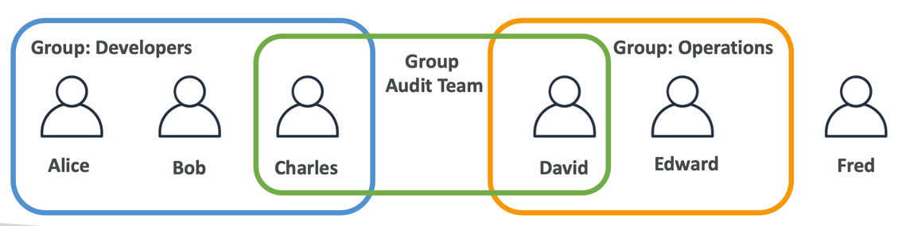

### IAM

IAM is a web service for securely controlling access to AWS services. With IAM, we can centrally manage users, security
credentials such as access keys, and permissions that control which AWS resources users and applications can access.

---

#### Main points:

- **Root account** - it's main account and as a rule using only by CTO, main architect, etc . Shouldn't be used or shared
- **Users** are people in your organization and can be groped
- **Groups** can only contains users, not other groups
- User can belong to multiple groups



---

#### Notes

When we create a user, we can create user with the following type:
- with access to AWS Console
- with access to console, sdk. For this case **access keys** must be created

---

#### IAM: Permissions
- We can create permissions for **users and groups**
- **Users and groups** can be assigned JSON documents called policies
- Example:
```json
{
  "Version": "2012-10-17",
  "Statement": [
    {
      "Effect": "Allow",
      "Action": "ec2:Describe*",
      "Resource": "*"
    },
    {
      "Effect": "Allow",
      "Action": "elasticloadbalancing:Describe*",
      "Resource": "*"
    },
    {
      "Effect": "Allow",
      "Action": [
        "cloudwatch:ListMetrics",
        "cloudwatch:GetMetricStatistics",
        "cloudwatch:Describe*"
      ],
      "Resource": "*"
    }
  ]
}
```
- These policies define the **permissions** of the users
- In AWS you apply the **least privilege principle**: don't give more permissions than a user needs
- We can create **inline** policies that only attached to the user. It means that we don't create group, we create polices directly for the user.

---

#### IAM: Policies Structure
Consist of:
- **Version**: policy language version, always include "2012-10-17"
- **Id**: an identifier for the policy (optional)
- **Statement**: one or more individual statements (required)

Statement consist of:
- **Sid**: statement id (optional)
- **Effect**: whether the statement allows or denies access (Allow, Deny)
- **Principles**: is which accounts, users or roles to which this policy will apply
- **Action**: list of actions this policy allows or denies
- **Resource**: list of resources to which the actions applied to
- **Condition**: (not present in the example below). Conditions for when this policy is in effect (optional)

```json
{
  "Version": "2012-10-17",
  "Id": "S3-Account-Permissions",
  "Statement": [
    {
      "Sid": "1",
      "Effect": "Allow",
      "Principal": {
        "AWS": ["arn:aws:iam::123456789012:root"]
      },
      "Action": [
        "s3:GetObject",
        "s3:PutObject"
      ],
      "Resource": ["arn:aws:s3:::mybucket/*"]
    }
  ]
}
```

---

#### IAM: Password Policy && Multi Factor Authentication (MFA)

In AWS we can use **Password Policy** and **Multi Factor Authentication** to protect accounts.

#### Password Policy:

We can set up some settings for password policy:
- Set a minimum password length
- Require specific character types:
  - including uppercase letters
  - lowercase letters
  - numbers
  - non-alphanumeric characters
- Allow all IAM users to change their own passwords
- Require users to change their password after some time (password expiration)
- Prevent password re-use

#### Multi Factor Authentication (MFA) 

- MFA = password you know + security device you own
- obvious benefit. If a password is stolen or hacked, the account is not compromised, because also device is needed to log in

MFA options in AWS:
- virtual MFA device: **Google-Authenticator** (only phones) or **Authy** (multi-devices)
- universal 2nd Factory (U2F) Security Key: it's a physical device (looks like flash-card)
- hardware Key Fob MFA Device: also physical device
- hardware Key Fob MFA Device for AWS GovCloud (US): also physical device that is using only in US
- of course, the most popular is **virtual MFA device**

---

#### IAM: How can users access AWS?

- To access AWS, we have three options:
    - AWS Management Console: protected by password + MFA (website)
    - AWS Command Line Interface (CLI): protected by access keys (console)
    - AWS Software Developer Kit (SDK): for code protected by access keys. Is used when you want to call AWS APIs from your application
- Access Keys are generated via AWS Console
- Users manage their own access keys
- Access Keys are secret, do not share them

---

#### What is AWS CLI?

- tool that allows you to interact with AWS services using commands in command-line shell
- direct access to public APIs of AWS services
- can develop scripts to manage resources

---

#### What is AWS SDK?

- language specific APIs (set of libraries)
- enables you to access and manage AWS services from your code (application)

---

#### IAM: Roles for Services

- some AWS services will need to perform actions on your behalf
- to do so, we should assign permissions to AWS services with IAM roles

So what does that mean? For example, we are going to create an EC2 Instance. But this EC2 Instance may want to perform some
actions on AWS and to do so, we need to give permissions to our EC2 Instance. To do so, we need to create an IAM Role
and together they're going to make one entity. And together, once the EC2 Instance is trying to access some information
from AWS, then it will use the IAM Role. And if the permission assigned to the IAM Role is correct, then we're going to
get access to the call we're trying to make.

Common roles:
- EC2 Instance Roles
- Lambda Functions Roles
- Roles For CloudFormation

---

#### IAM: Security Tools

- IAM Credentials Report (account-level):
    - a report that lists all your account's users and the status of their various credentials
- IAM Access Advisor (user-level)
    - Access advisor shows the service permissions granted to a user and when those services were last accessed.
    - You can use this information to revise your policies

---

#### Best Practices

- do not use the root account except for AWS account set up
- one physical user = one AWS user
- assign **users** to **groups** and assign **permissions** to **group**
- create a strong password policy
- use and enforce the use of **Multi Factor Authentication (MFA)**
- create and use **Roles** for giving permissions to AWS services
- audit permissions of your account using **IAM Credentials Report & IAM Access Advisor**
- never share IAM users & Access Keys

---

#### Summary

- **Users**: mapped to a physical user, has a password for AWS console
- **Groups**: contains only users
- **Policies**: JSON document that outlines permissions for users or groups
- **Roles**: for AWS Services (EC2 for example)
- **Security**: Password Policy + MFA
- **AWS-CLI**: manage AWS services using the command-line
- **AWS-SDK**: manage AWS services via programming language (application)
- **Access keys**: access AWS using the CLI or SDK
- **Audit**: IAM Credentials Report & IAM Access Advisor 