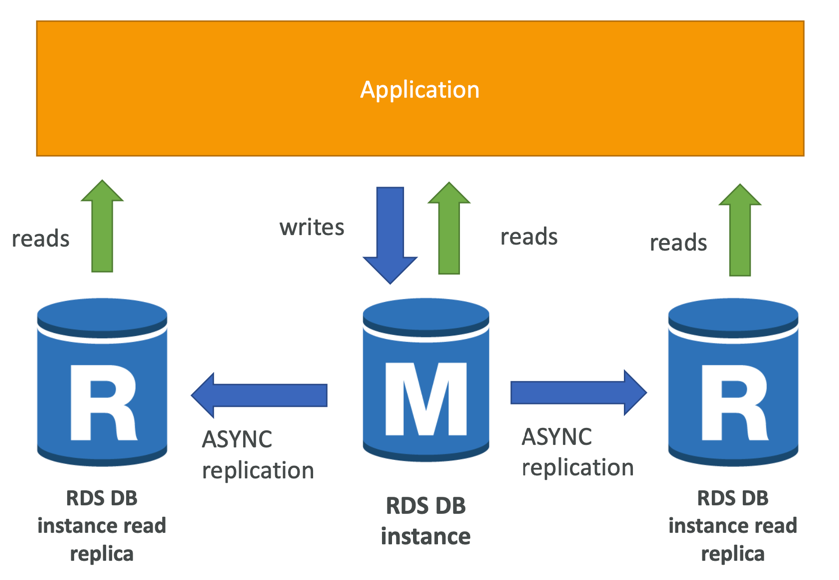
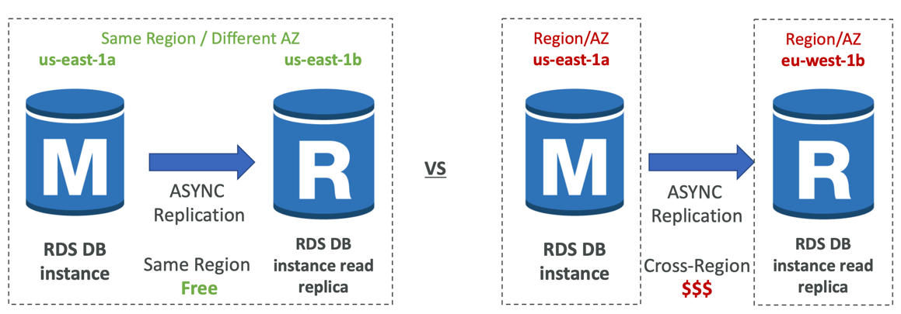
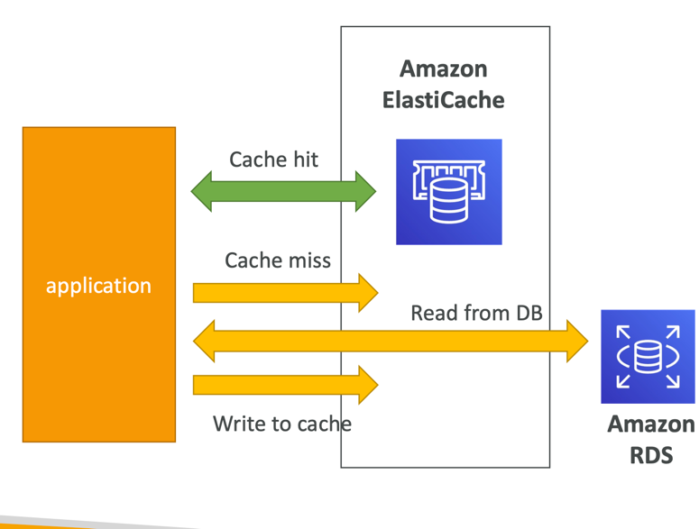
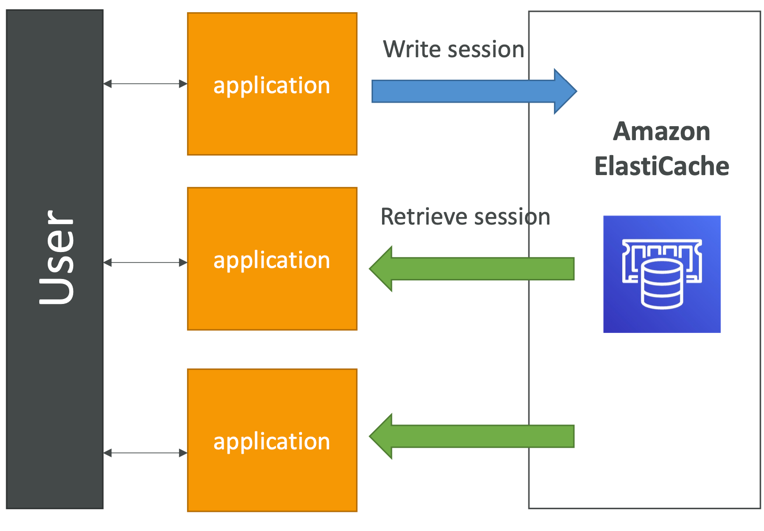
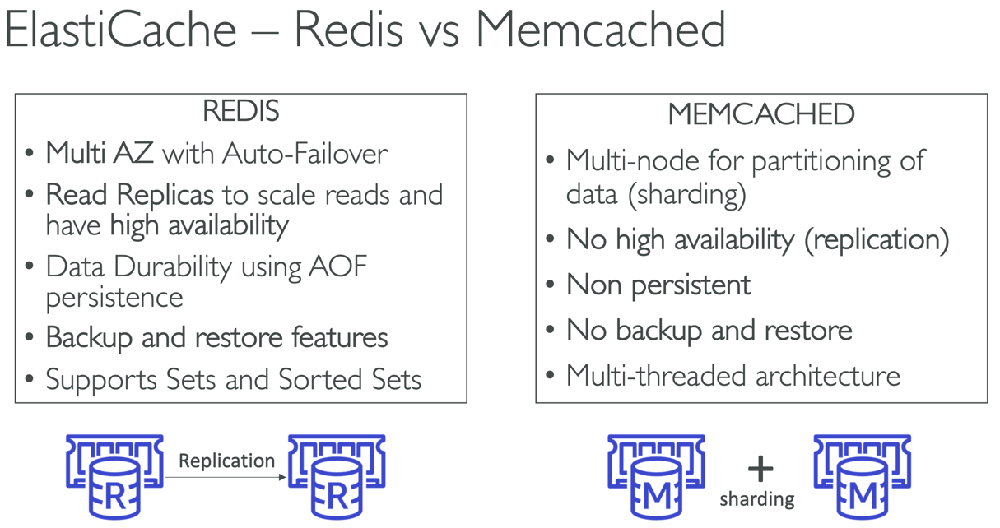

### RDS, Aurora & ElasticCache

---

### Amazon RDS Overview

- RDS stands for Relational Database Service
- It’s a managed DB service for DB use SQL as a query language.
- It allows you to create databases in the cloud that are managed by AWS
  - Postgres
  - MySQL
  - MariaDB
  - Oracle
  - Microsoft SQL Server
  - Aurora (AWS Proprietary database)

#### Advantage over using RDS versus deploying DB on EC2

- RDS is a managed service:
  - Automated provisioning, OS patching
  - Continuous backups and restore to specific timestamp (Point in Time Restore)!
  - Monitoring dashboards
  - Read replicas for improved read performance
  - Multi AZ setup for DR (Disaster Recovery)
  - Scaling capability (vertical and horizontal)
  - Storage backed by EBS (gp2 or io1)
- BUT you can’t SSH into your instances

#### RDS – Storage Auto Scaling

- Helps you increase storage on your RDS DB instance dynamically
- When RDS detects you are running out of free database storage, it scales automatically
- Avoid manually scaling your database storage
- You have to set Maximum Storage Threshold (maximum limit for DB storage)
- Automatically modify storage if:
    - Free storage is less than 10% of allocated storage
    - Low-storage lasts at least 5 minutes
    - 6 hours have passed since last modification
- Useful for applications with unpredictable workloads
- Supports all RDS database engines (MariaDB, MySQL, Storage PostgreSQL, SQL Server, Oracle)

---

### RDS Read Replicas for read scalability

- Up to 15 Read Replicas
- Within AZ, Cross AZ or Cross Region
- Replicas can be promoted to their own DB
- Applications must update the connection string to leverage read replicas

#### Use cases

- You have a production database that is taking on normal load
- You want to run a reporting application to run some analytics
- You create a Read Replica to run the new workload there
- The production application is unaffected
- Read replicas are used for SELECT (=read) only kind of statements (not INSERT, UPDATE, DELETE)

---

### RDS Read Replicas – Network Cost

- In AWS there’s a network cost when data goes from one AZ to another
- For RDS Read Replicas within the same region, you don’t pay that fee

---

### Amazon Aurora

- Aurora is a proprietary technology from AWS (not open sourced)
- Postgres and MySQL are both supported as Aurora DB (that means your drivers will work as if Aurora was a Postgres or MySQL database)
- Aurora is “AWS cloud optimized” and claims 5x performance improvement over MySQL on RDS, over 3x the performance of Postgres on RDS
- Aurora storage automatically grows in increments of 10GB, up to 128 TB.
- Aurora can have up to 15 replicas and the replication process is faster than
MySQL (sub 10 ms replica lag)
- Failover in Aurora is instantaneous. It’s HA (High Availability) native.
- Aurora costs more than RDS (20% more) – but is more efficient

---

#### Aurora High Availability and Read Scaling

- 6 copies of your data across 3 AZ:
- One Aurora Instance takes writes (master)
- Automated failover for master in less than 30 seconds
- Master + up to 15 Aurora Read Replicas serve reads
- Support for Cross Region Replication

**Writer Endpoint** - is a DNS name to the instance that responsible for writes data. If this instance fails, and it will
be replaced to another instance, that DNS name will be the same (it means that we don't need to change configuration to connect
to another instance)

**Reader Endpoint** - is a DNS name to the read instances. We can have up to 15 replicas, and it can be difficult to handle
connections to these replicas, but with **reader endpoint**, we don't to know connection details of these replicas, we can
use this **reader endpoint** (DNS name), and load balancer will automatically connect to correct replica instance

---

#### Features of Aurora

- Automatic fail-over
- Backup and Recovery
- Isolation and security
- Industry compliance
- Push-button scaling
- Automated Patching with Zero Downtime
- Advanced Monitoring
- Routine Maintenance
- Backtrack: restore data at any point of time without using backups

---

### RDS and Aurora Backups

RDS:
- Automated backups:
  - Daily full backup of the database (during the backup window)
  - Transaction logs are backed-up by RDS every 5 minutes
  - => ability to restore to any point in time (from oldest backup to 5 minutes ago)
  - 1 to 35 days of retention, set 0 to disable automated backups
- Manual DB Snapshots
  - Manually triggered by the user
  - Retention of backup for as long as you want
- Trick: in a stopped RDS database, you will still pay for storage. If you plan on stopping it for a long time, you should snapshot & restore instead

Aurora:
- Automated backups
  - 1 to 35 days (cannot be disabled)
  - point-in-time recovery in that timeframe
- Manual DB Snapshots
  - Manually triggered by the user
  - Retention of backup for as long as you want

#### RDS & Aurora Restore options

- Restoring a RDS / Aurora backup or a snapshot creates a new database
- Restoring MySQL RDS database from S3
  - Create a backup of your on-premises database
  - Store it on Amazon S3 (object storage)
  - Restore the backup file onto a new RDS instance running MySQL
- Restoring MySQL Aurora cluster from S3
  - Create a backup of your on-premises database using Percona XtraBackup
  - Store the backup file on Amazon S3
  - Restore the backup file onto a new Aurora cluster running MySQL

#### Aurora Database Cloning

- Create a new Aurora DB Cluster from an existing one
- Faster than snapshot & restore
- Uses copy-on-write protocol
  - Initially, the new DB cluster uses the same data volume as the original DB cluster (fast and efficient – no copying is needed)
  - When updates are made to the new DB cluster data, then additional storage is allocated and data is copied to be separated
- Very fast & cost-effective
- Useful to create a “staging” database from a “production” database without impacting the production database

---

### RDS & Aurora Security

- At-rest encryption:
  - Database master & replicas encryption using AWS KMS – must be defined as launch time
  - If the master is not encrypted, the read replicas cannot be encrypted
  - To encrypt an un-encrypted database, go through a DB snapshot & restore as encrypted
- In-flight encryption: TLS-ready by default, use the AWS TLS root certificates client-side
- Security Groups: Control Network access to your RDS / Aurora DB
- No SSH available except on RDS Custom
- Audit Logs can be enabled and sent to CloudWatch Logs for longer retention

--- 

### Amazon ElastiCache Overview

- ElastiCache is to get managed Redis or Memcached
- Caches are in-memory databases with really high performance, low latency
- Helps reduce load off of databases for read intensive workloads
- Helps make your application stateless
- AWS takes care of OS maintenance / patching, optimizations, setup, configuration, monitoring, failure recovery and backups
- Using ElastiCache involves heavy application code changes

#### DB Cache

- Applications queries ElastiCache, if not available, get from RDS and store in ElastiCache.
- Helps relieve load in RDS
- Cache must have an invalidation strategy to make sure only the most current data is used in there.

#### User Session Store

- User logs into any of the application
- The application writes the session data into ElastiCache
- The user hits another instance of our application
- The instance retrieves the data and the user is already logged in

#### ElastiCache – Redis vs Memcached

#### ElastiCache – Cache Security

- ElastiCache supports IAM Authentication for Redis
- IAM policies on ElastiCache are only used for AWS API-level security
- Redis AUTH
  - You can set a “password/token” when you create a
  Redis cluster
  - This is an extra level of security for your cache (on top of security groups)
  - Support SSL in flight encryption
- Memcached
  - Supports SASL-based authentication (advanced)

#### Patterns for ElastiCache

- Lazy Loading: all the read data is cached, data can become stale in cache
- Write Through: Adds or update data in the cache when written to a DB (no stale data)
- Session Store: store temporary session data in a cache (using TTL features)

#### ElastiCache – Redis Use Case

- Gaming Leaderboards are computationally complex
- Redis Sorted sets guarantee both uniqueness and element ordering
- Each time a new element added, it’s ranked in real time, then added in correct order
