### What is DNS?

- Domain Name System which translates the human friendly hostnames into the machine IP addresses
- www.google.com => 172.217.18.36

#### DNS Terminologies

- **Domain Registrar**: Amazon Route 53, GoDaddy, ...
- **DNS Records**: A, AAAA, CNAME, NS, ...
- **Zone File**: contains DNS records
- **Name Server**: resolves DNS queries (Authoritative or Non-Authoritative)
- **Top Level Domain (TLD)**: .com, .us, .in, .gov, .org, ...
- **Second Level Domain (SLD)**: amazon.com, google.com, ...

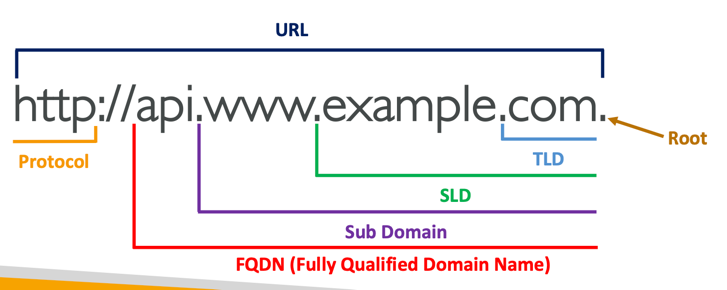

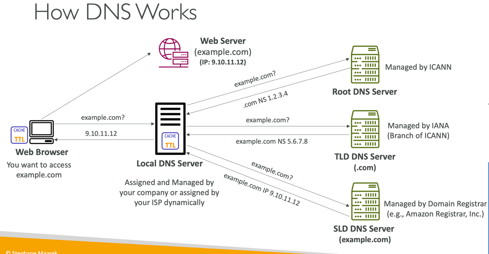

---

### Amazon Route 53

- A highly available, scalable, fully managed and Authoritative DNS
    - Authoritative = the customer (you) can update the DNS records
- Route 53 is also a Domain Registrar
- Ability to check the health of your resources
- Why Route 53? 53 is a reference to the traditional DNS port

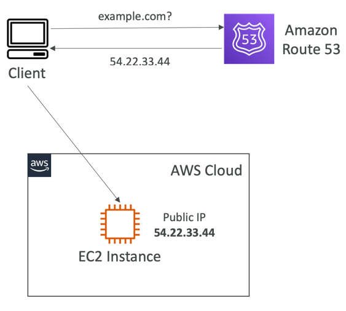

#### Route 53 – Records

- How you want to route traffic for a domain
- Each record contains:
    - Domain/subdomain Name – example.com
    - Record Type – A or AAAA
    - Value – 12.34.56.78
    - Routing Policy – how Route 53 responds to queries
    - TTL – amount of time the record cached at DNS Resolvers
- Route 53 supports the following DNS record types:
    - A /AAAA / CNAME / NS
    - (advanced) CAA/DS/MX/NAPTR/PTR/SOA/TXT/SPF/SRV

#### RecordTypes

- A – maps a hostname to IPv4
- AAAA – maps a hostname to IPv6
- CNAME – maps a hostname to another hostname
    - The target is a domain name which must have an A or AAAA record
    - Can’t create a CNAME record for the top node of a DNS namespace (Zone Apex)
    - Example: you can’t create for example.com, but you can create for www.example.com
- NS – Name Servers for the Hosted Zone
    - Control how traffic is routed for a domain

#### Route 53 – Hosted Zones

- A container for records that define how to route traffic to a domain and its subdomains
- Public Hosted Zones – contains records that specify how to route traffic on the Internet (public domain names) application1.mypublicdomain.com
- Private Hosted Zones – contain records that specify how you route traffic within one or more VPCs (private domain names) application1.company.internal
- You pay $0.50 per month per hosted zone

---

### Route 53 – RecordsTTL (TimeTo Live)

- High TTL – e.g., 24 hr
  - Less traffic on Route 53
  - Possibly outdated records
- Low TTL – e.g., 60 sec.
  - More traffic on Route 53 ($$)
  - Records are outdated for less time
  - Easy to change records
- Except for Alias records,TTL is mandatory for each DNS record

---

### Routing Policies

- Define how Route 53 responds to DNS queries
- Don’t get confused by the word “Routing”
  - It’s not the same as Load balancer routing which routes the traffic
  - DNS does not route any traffic, it only responds to the DNS queries
- Route 53 Supports the following Routing Policies
  - Simple
  - Weighted
  - Failover
  - Latency based
  - Geolocation
  - Multi-Value Answer
  - Geoproximity (using Route 53 Traffic Flow feature)

#### Simple

- Typically, route traffic to a single resource
- Can specify multiple values in the same record
- If multiple values are returned, a random one is chosen by the client
- When Alias enabled, specify only one AWS resource
- Can’t be associated with Health Checks

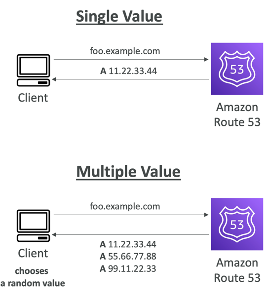

#### Weighted

- Control the % of the requests that go to each specific resource
- Assign each record a relative weight:
  - traffic (%) = weight for specific record / sum of all weights for all records
  - Weights don’t need to sum up to 100
- DNS records must have the same name and type
- Can be associated with Health Checks
- Use cases: load balancing between regions, testing new application versions...
- Assign a weight of 0 to a record to stop sending traffic to a resource
- If all records have weight of 0, then all records will be returned equally

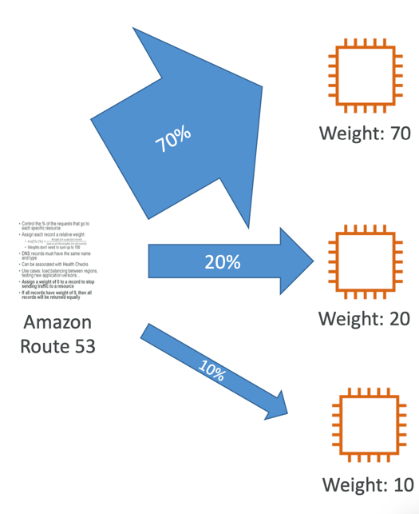

#### Latency-based

- Redirect to the resource that has the least latency close to us
- Super helpful when latency for users is a priority
- Latency is based on traffic between users and AWS Regions
- Germany users may be directed to the US (if that’s the lowest latency)
- Can be associated with Health Checks (has a failover capability)

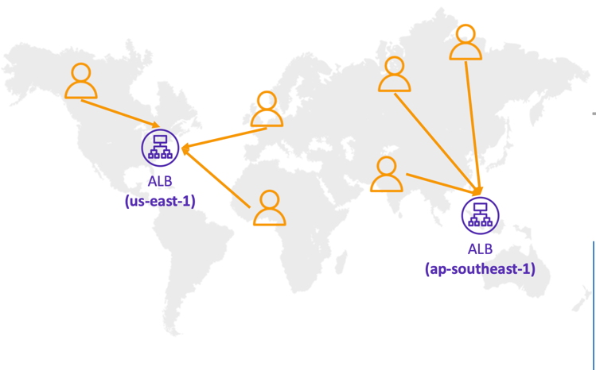

#### Failover (Active-Passive)

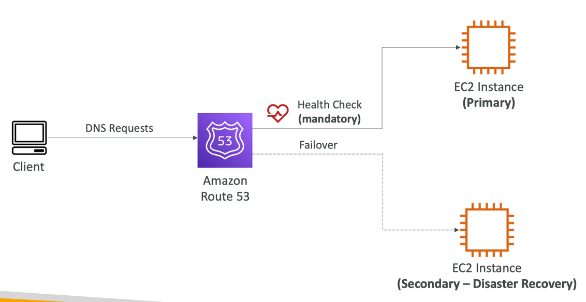

#### Geolocation

- Different from Latency-based!
- This routing is based on user location
- Specify location by Continent, Country or by US State (if there’s overlapping, most precise location selected)
- Should create a “Default” record (in case there’s no match on location)
- Use cases: website localization, restrict content distribution, load balancing, ...
- Can be associated with Health Checks

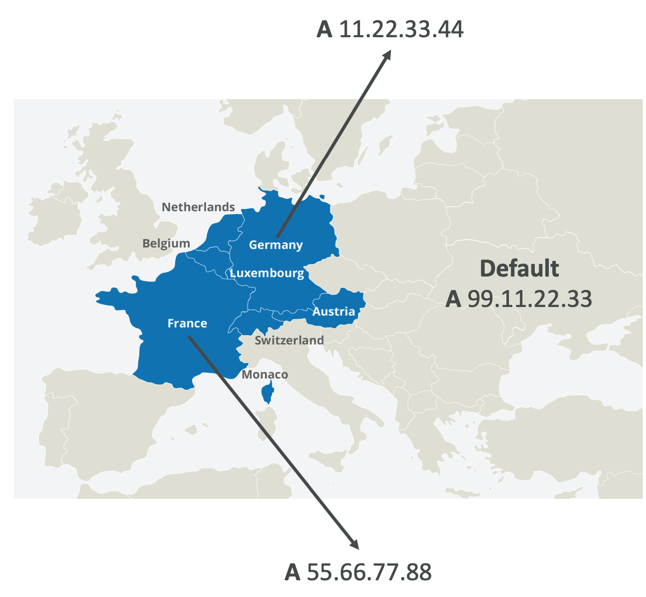

#### Geoproximity

- Route traffic to your resources based on the geographic location of users and resources
- Ability to shift more traffic to resources based on the defined bias
- To change the size of the geographic region, specify bias values:
  - To expand (1 to 99) – more traffic to the resource
  - To shrink (-1 to -99) – less traffic to the resource
- Resources can be:
  - AWS resources (specify AWS region)
  - Non-AWS resources (specify Latitude and Longitude)
  - You must use Route 53 Traffic Flow to use this feature

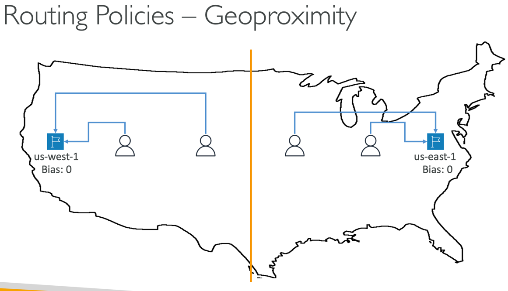
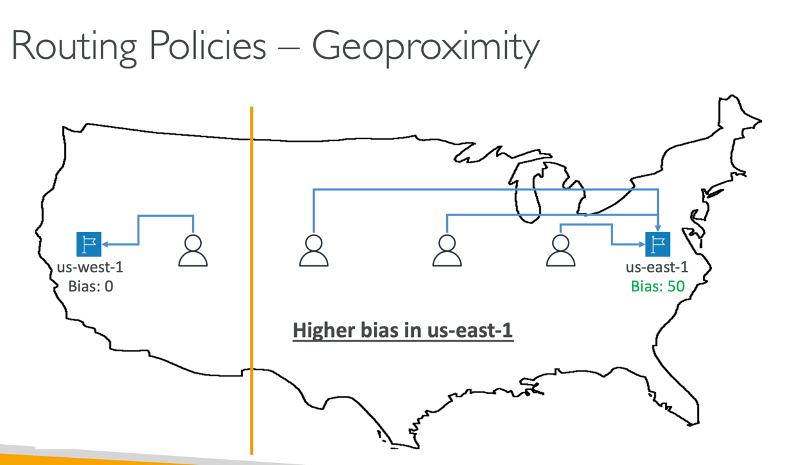

#### IP-based Routing

- Routing is based on clients’ IP addresses
- You provide a list of CIDRs for your clients and the corresponding endpoints/locations (user-IP-to-endpoint mappings)
- Use cases: Optimize performance, reduce network costs...
- Example: route end users from a particular ISP to a specific endpoint

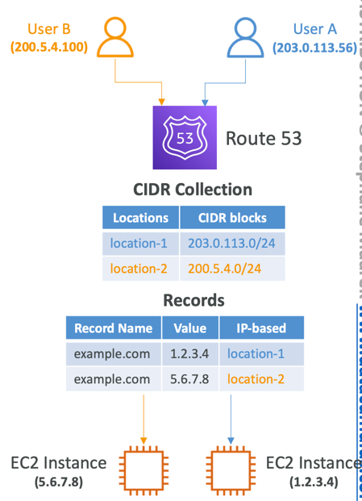

#### Multi-Value

- Use when routing traffic to multiple resources
- Route 53 return multiple values/resources
- Can be associated with Health Checks (return only values for healthy resources) 
- Up to 8 healthy records are returned for each Multi-Value query
- Multi-Value is not a substitute for having an ELB