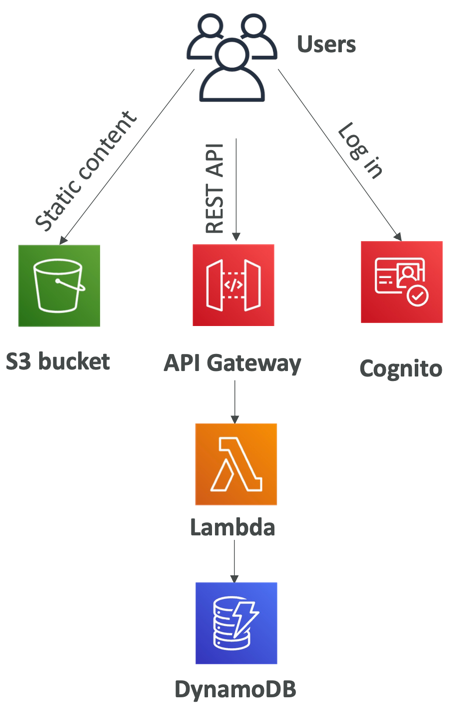
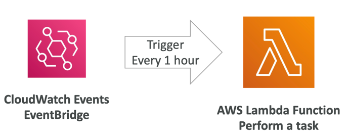
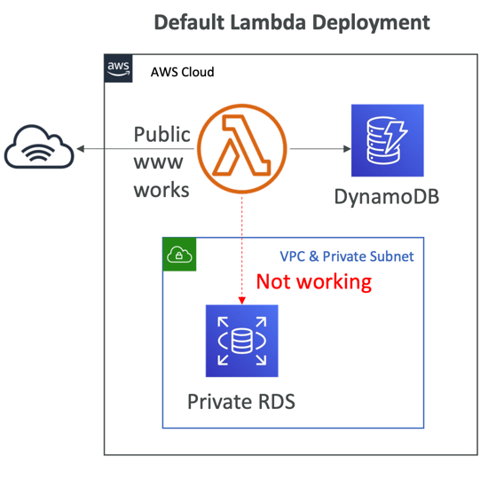
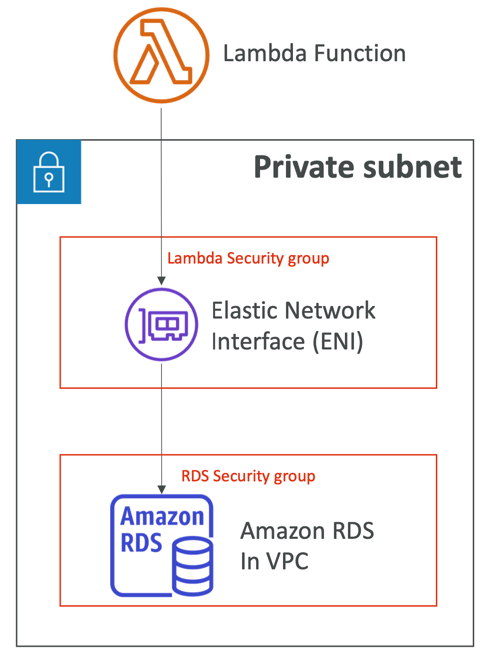
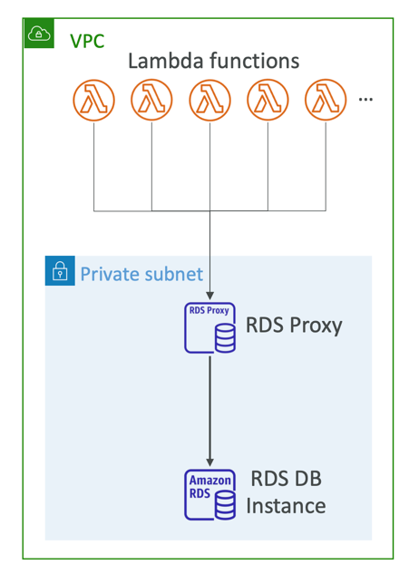
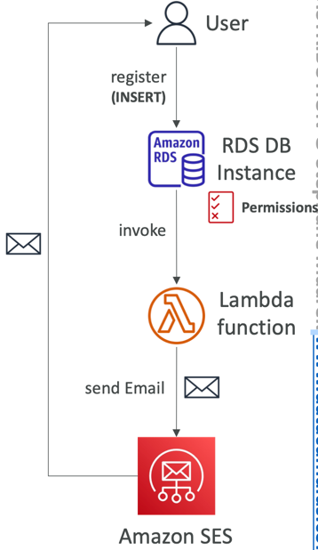
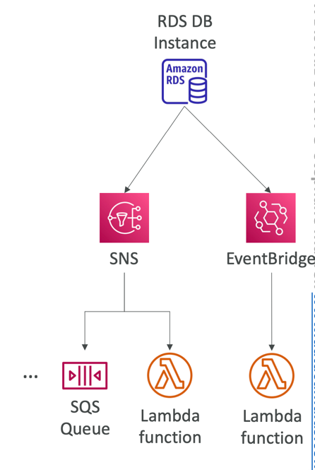

### What’s serverless?

- Serverless is a new paradigm in which the developers don’t have to manage servers anymore...
- They just deploy code
- They just deploy... functions !
- Initially... Serverless == FaaS (Function as a Service)
- Serverless was pioneered by AWS Lambda but now also includes anything that’s managed: “databases, messaging, storage, etc.”
- Serverless does not mean there are no servers... it means you just don’t manage / provision / see them

---

### Serverless in AWS

- AWS Lambda
- DynamoDB
- AWS Cognito
- AWS API Gateway - Amazon S3
- AWS SNS & SQS
- AWS Kinesis Data Firehose - Aurora Serverless
- Step Functions
- Fargate

---

### Why AWS Lambda

- Amazon EC2
  - Virtual Servers in the Cloud
  - Limited by RAM and CPU
  - Continuously running
  - Scaling means intervention to add / remove servers
- Amazon Lambda
  - Virtual functions – no servers to manage!
  - Limited by time - short executions
  - Run on-demand
  - Scaling is automated!

---

### Benefits of AWS Lambda

- Easy Pricing:
  - Pay per request and compute time
  - Free tier of 1,000,000 AWS Lambda requests and 400,000 GBs of compute time
- Integrated with the whole AWS suite of services
- Integrated with many programming languages
- Easy monitoring through AWS CloudWatch
- Easy to get more resources per functions (up to 10GB of RAM!)
- Increasing RAM will also improve CPU and network!

---

### AWS Lambda language support

- Node.js (JavaScript)
- Python
- Java (Java 8 compatible)
- C# (.NET Core)
- Golang
- C# / Powershell
- Ruby
- Custom Runtime API (community supported, example Rust)
- Lambda Container Image
  - The container image must implement the Lambda Runtime API (cannot use regular docker image)
  - ECS / Fargate is preferred for running arbitrary Docker images

---

### AWS Lambda Integrations. Main ones

---

### Example: Serverless Thumbnail creation

---

### Example: Serverless CRON Job

---

### AWS Lambda Pricing: example

- You can find overall pricing information here:
https://aws.amazon.com/lambda/pricing/
- Pay per calls:
  - First 1,000,000 requests are free
  - $0.20 per 1 million requests thereafter ($0.0000002 per request)
- Pay per duration: (in increment of 1 ms)
  - 400,000 GB-seconds of compute time per month for FREE
  - == 400,000 seconds if function is 1GB RAM
  - == 3,200,000 seconds if function is 128 MB RAM
  - After that $1.00 for 600,000 GB-seconds
  - It is usually very cheap to run AWS Lambda so it’s very popular

---

### AWS Lambda Limits to Know - per region

- Execution:
  - Memory allocation: 128 MB – 10GB (1 MB increments)
  - Maximum execution time: 900 seconds (15 minutes)
  - Environment variables (4 KB)
  - Disk capacity in the “function container” (in /tmp): 512 MB to 10GB
  - Concurrency executions: 1000 (can be increased)
- Deployment:
  - Lambda function deployment size (compressed .zip): 50 MB
  - Size of uncompressed deployment (code + dependencies): 250 MB
  - Can use the /tmp directory to load other files at startup
  - Size of environment variables: 4 KB

--- 

### Customization At The Edge

- Many modern applications execute some form of the logic at the edge
- Edge Function:
  - A code that you write and attach to CloudFront distributions
  - Runs close to your users to minimize latency
- CloudFront provides two types: CloudFront Functions & Lambda@Edge
- You don’t have to manage any servers, deployed globally
- Use case: customize the CDN content 
- Pay only for what you use
- Fully serverless

#### CloudFront Functions & Lambda@Edge. Use Cases

- Website Security and Privacy
- Dynamic Web Application at the Edge
- Search Engine Optimization (SEO)
- Intelligently Route Across Origins and Data Centers
- Bot Mitigation at the Edge
- Real-time Image Transformation
- A/BTesting
- User Authentication and Authorization
- User Prioritization
- User Tracking and Analytics

#### CloudFront Functions

- Lightweight functions written in JavaScript
- For high-scale, latency-sensitive CDN customizations
- Sub-ms startup times, millions of requests/second
- Used to change Viewer requests and responses:
  - Viewer Request: after CloudFront receives a request from a viewer
  - Viewer Response: before CloudFront forwards the response to the viewer
- Native feature of CloudFront (manage code entirely within CloudFront)

#### Lambda@Edge

- Lambda functions written in NodeJS or Python
- Scales to 1000s of requests/second
- Used to change CloudFront requests and responses:
  - Viewer Request – after CloudFront receives a request from a viewer
  - Origin Request – before CloudFront forwards the request to the origin
  - Origin Response – after CloudFront receives the response from the origin
  - Viewer Response – before CloudFront forwards the response to the viewer
- Author your functions in one AWS Region (us-east-1), then CloudFront replicates to its locations

#### CloudFront Functions vs. Lambda@Edge - Use Cases

CloudFront Functions
- Cache key normalization
  - Transform request attributes (headers, cookies, query strings, URL) to create an optimal Cache Key
- Header manipulation
  - Insert/modify/delete HTTP headers in the request or response
- URL rewrites or redirects
- Request authentication & authorization
  - Create and validate user-generated tokens (e.g., JWT) to allow/deny requests

Lambda@Edge
- Longer execution time (several ms)
- Adjustable CPU or memor y
- Your code depends on a 3rd libraries (e.g., AWS SDK to access other AWS services)
- Network access to use external ser vices for processing
- File system access or access to the body of HTTP requests

---

### Lambda in VPC

#### Lambda by default

- By default, your Lambda function is launched outside your own VPC (in an AWS-owned VPC)
- Therefore, it cannot access resources in your VPC (RDS, ElastiCache, internal ELB...)

#### Lambda in VPC

- You must define the VPC ID, the Subnets and the Security Groups
- Lambda will create an ENI (Elastic Network Interface) in your subnets

#### Lambda with RDS Proxy

- If Lambda functions directly access your database, they may open too many connections under high load
- RDS Proxy
  - Improve scalability by pooling and sharing DB connections
  - Improve availability by reducing by 66% the failover time and preserving connections
  - Improve security by enforcing IAM authentication and storing credentials in Secrets Manager
- The Lambda function must be deployed in your VPC, because RDS Proxy is never publicly accessible

---

### Invoking Lambda from RDS & Aurora

- Invoke Lambda functions from within your DB instance
- Allows you to process data events from within a database
- Supported for RDS for PostgreSQL and Aurora MySQL
- Must allow outbound traffic to your Lambda function from within your DB instance (Public, NAT GW,VPC Endpoints)
- DB instance must have the required permissions to invoke the Lambda function (Lambda Resource-based Policy & IAM Policy)

#### RDS Event Notifications

- Notifications that tells information about the DB instance itself (created, stopped, start, ...)
- You don’t have any information about the data itself
- Subscribe to the following event categories: DB instance, DB snapshot, DB Parameter Group, DB Security Group, RDS Proxy, Custom Engine Version
- Near real-time events (up to 5 minutes)
- Send notifications to SNS or subscribe to events using EventBridge

