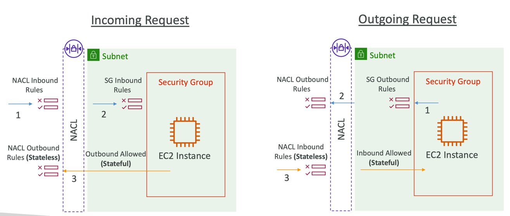
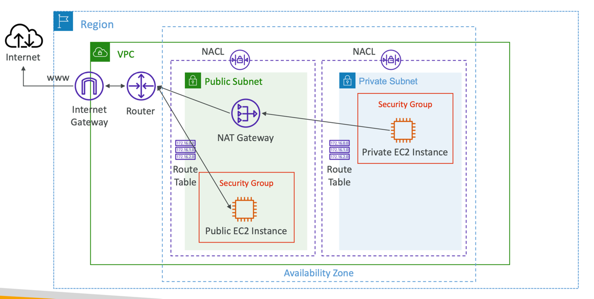
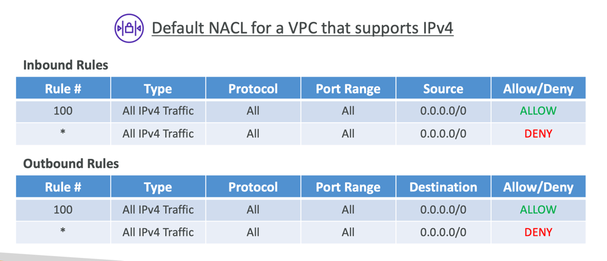
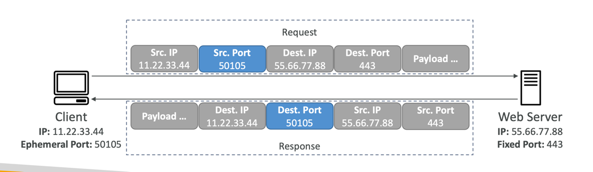
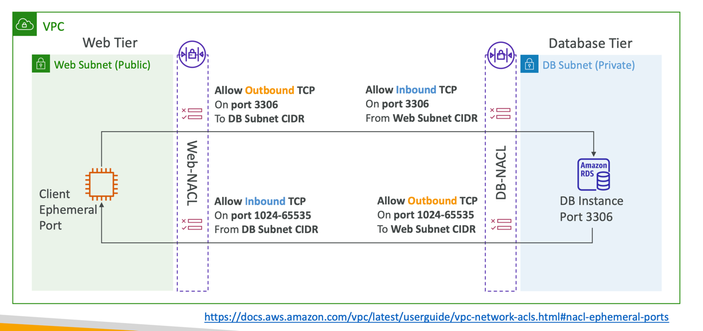
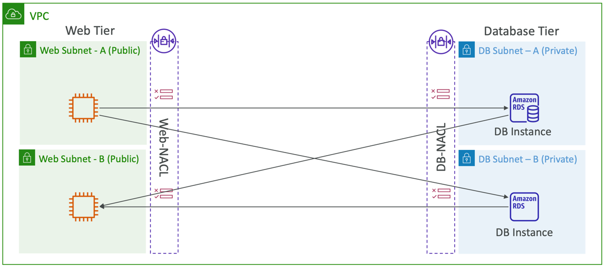
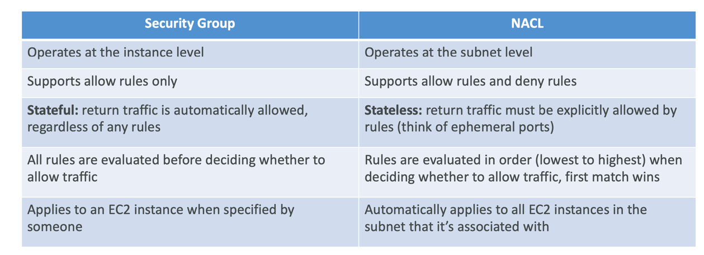

### Security Groups & NACLs (or 'Network ACL' or 'Network Access Control List')

NACL stands for Network Access Control List. It's a fundamental component of Amazon Virtual Private Cloud (VPC) networking.
NACLs act as a virtual firewall for controlling traffic in and out of your VPC at the subnet level. 

Here's a brief explanation of NACLs:

1) Network-Level Filtering: NACLs are stateless and operate at the network level. They evaluate traffic based on rules you
define for inbound and outbound traffic separately.
2) Rule-Based Access Control: You can create rules in NACLs that allow or deny traffic based on various factors such as
source/destination IP addresses, port ranges, and protocols.
3) Numbered Rules: Rules in a NACL are numbered, and they are evaluated in ascending order. When a network packet enters
a subnet associated with a NACL, AWS evaluates the packet against each rule in order until a matching rule is found. Once
a match is found, the action of that rule (allow or deny) is applied, and no further rule evaluation occurs for that packet.
4) Default NACL: Every VPC comes with a default NACL that allows all inbound and outbound traffic. You can modify this
default NACL (not recommended to modify default NACL) or create custom NACLs as needed (it's the best decision if you 
need to create custom NACL).
5) Associating with Subnets: Each NACL is associated with one or more subnets within your VPC. Subnets can only be associated
with one NACL at a time.
6) Stateless: NACLs are stateless, meaning that if you allow traffic in one direction, you must explicitly allow the corresponding
return traffic if required. Stateful inspection, as seen in traditional firewalls, is not part of NACL functionality.

NACLs are a useful tool for controlling network traffic in your VPC, particularly when you need to restrict or allow specific
types of traffic at the subnet level. When designing your VPC network architecture, you'll often use a combination of NACLs
and security groups to ensure the security and accessibility of your resources.

--- 

### Network Access Control List (NACL)

- NACL are like a firewall which control traffic from and to subnets
- One NACL per subnet, new subnets are assigned the Default NACL NACL are like a firewall which control traffic from and
to subnets
- You define NACL Rules:
  - Rules have a number (1-32766), higher precedence with a lower number
  - First rule match will drive the decision
  - Example: if you define #100 ALLOW 10.0.0.10/32 and #200 DENY 10.0.0.10/32, the IP address will be allowed because 100 has a higher precedence over 200
  - The last rule is an asterisk (*) and denies a request in case of no rule match
  - AWS recommends adding rules by increment of 100
- Newly created NACLs will deny everything
- NACL are a great way of blocking a specific IP address at the subnet level

---

### NACLs

---

### Default NACL

- Accepts everything inbound/outbound with the subnets it’s associated with
- Do NOT modify the Default NACL, instead create custom NACLs

---

### Ephemeral Ports

- For any two endpoints to establish a connection, they must use ports
- Clients connect to a defined port, and expect a response on an ephemeral port
- Different Operating Systems use different port ranges, examples:
  - IANA & MS Windows 10 -> 49152–65535
  - Many Linux Kernels -> 32768 – 60999

---

### NACL with Ephemeral Ports

docs https://docs.aws.amazon.com/vpc/latest/userguide/vpc-network-acls.html#nacl-ephemeral-ports

---

### Create NACL rules for each target subnets CIDR

---

### Security Group vs. NACLs

NACL Examples: https://docs.aws.amazon.com/vpc/latest/userguide/vpc-network-acls.html