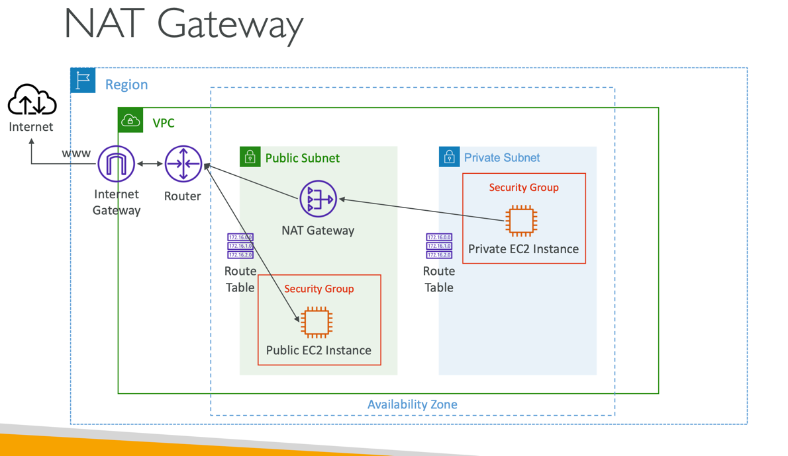
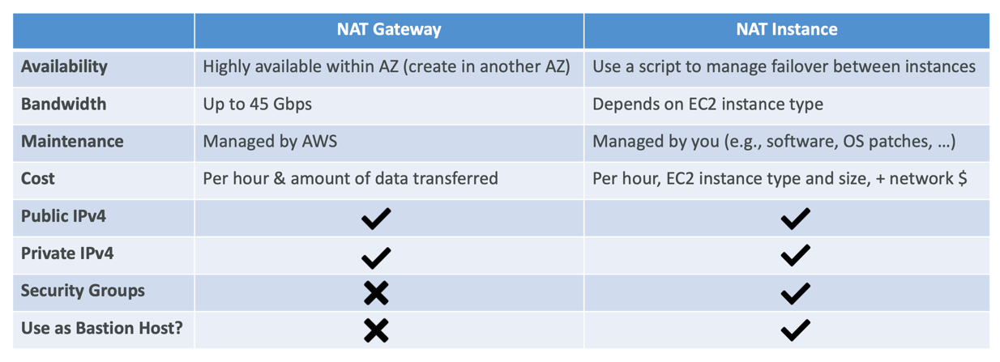
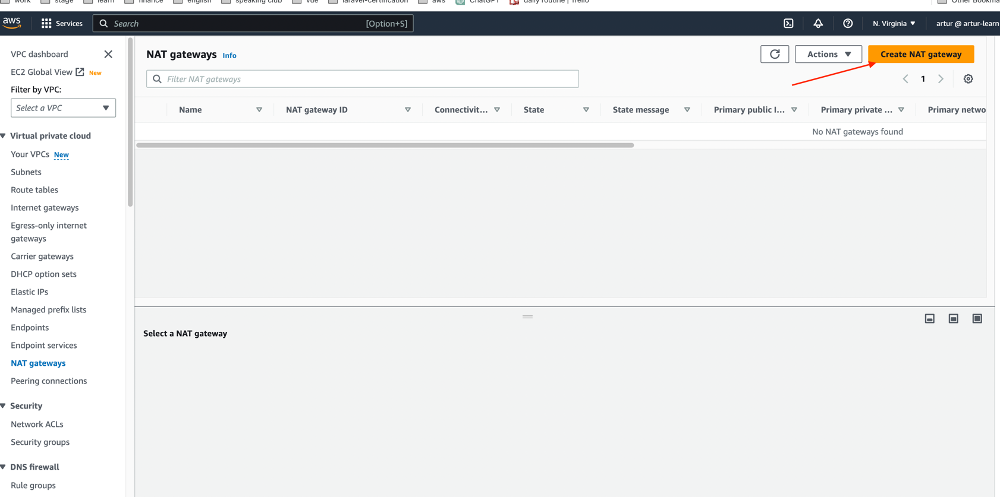
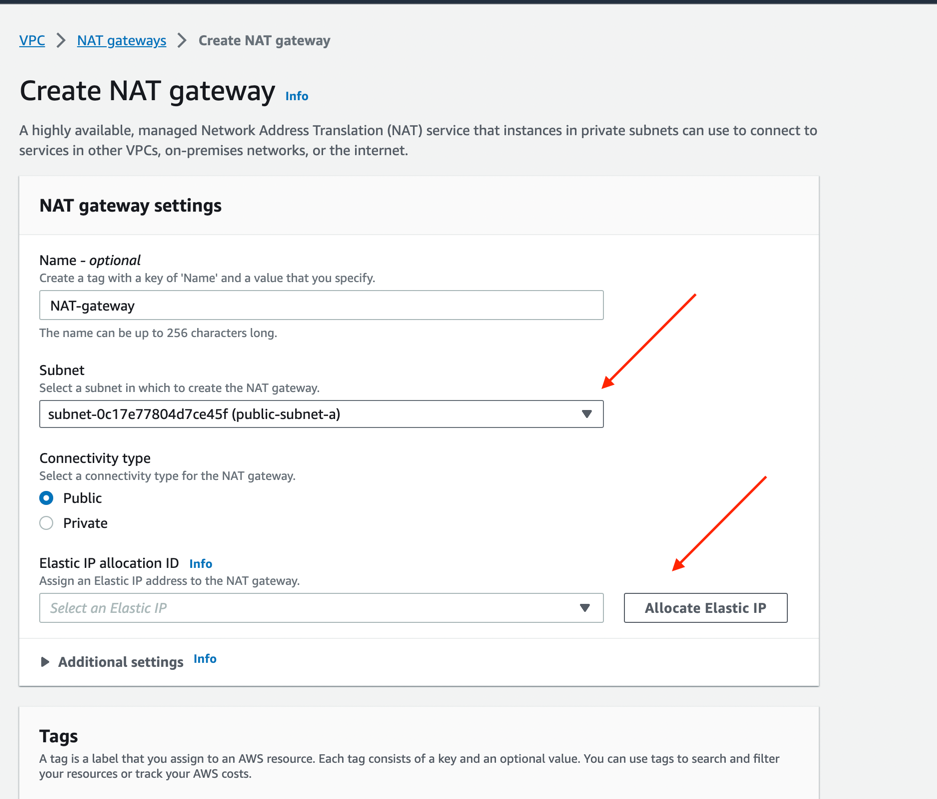
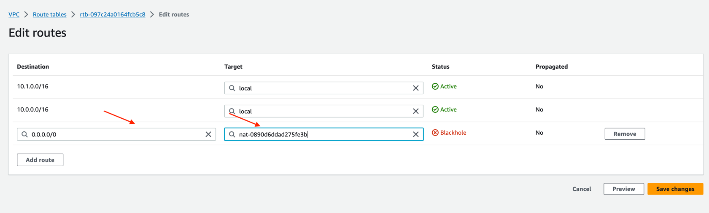

### NAT Gateway 

In Amazon Web Services (AWS), a NAT Gateway is a managed network address translation (NAT) service that allows instances
in a Virtual Private Cloud (VPC) to initiate outbound traffic to the internet while maintaining a high level of availability,
redundancy, and scalability. NAT Gateways are an alternative to NAT instances and offer several advantages, including ease
of use and improved performance. Here are the key characteristics and benefits of NAT Gateways:

1. Managed Service: NAT Gateways are fully managed by AWS. You do not need to create or manage individual EC2 instances like
you would with NAT instances. AWS takes care of the underlying infrastructure and maintenance.

2. High Availability: NAT Gateways are highly available and redundant by design. They are automatically distributed across
multiple availability zones (AZs) within a region. This ensures that even if one AZ experiences issues, the NAT Gateway remains accessible via another AZ.

3. Scalability: NAT Gateways can handle a large volume of outbound traffic. They automatically scale based on the traffic load,
so you don't need to worry about instance types or manual scaling as your workload grows.

4. Elastic IP Addresses: Each NAT Gateway is associated with an Elastic IP (EIP) address. This EIP is used as the public
IP address for instances in your private subnets when they initiate outbound traffic.

5. Simplified Configuration: Setting up a NAT Gateway is straightforward. You create one in your VPC and associate it with
a specific private subnet's route table. It takes care of the NAT configuration for you.

6. Security Groups: NAT Gateways do not have security groups associated with them, which helps improve security posture
by reducing attack surface.

7. Route Configuration: To use a NAT Gateway, you update the route table of your private subnet(s) to route outbound traffic
(0.0.0.0/0) to the NAT Gateway. This configuration allows instances in the private subnet to reach the internet through the NAT Gateway.

NAT Gateways are typically the preferred choice for enabling outbound internet connectivity from private instances in a
VPC due to their simplicity, reliability, and automatic scaling capabilities. They are especially well-suited for scenarios
where high availability and performance are essential.

---

- AWS-managed NAT, higher bandwidth, high availability, no administration
- Pay per hour for usage and bandwidth
- NATGW is created in a specific Availability Zone, uses an Elastic IP
- Can’t be used by EC2 instance in the same subnet (only from other subnets)
- Requires an IGW (Private Subnet => NATGW => IGW)
- 5 Gbps of bandwidth with automatic scaling up to 45 Gbps
- No Security Groups to manage / required

---

#### NAT Gateway with High Availability

- NAT Gateway is resilient within a single Availability Zone
- Must create multiple NAT Gateways in multiple AZs for fault-tolerance
- There is no cross-AZ failover needed because if an AZ goes down it doesn't need NAT

---

#### NAT Gateway vs. NAT Instance

More at: https://docs.aws.amazon.com/vpc/latest/userguide/vpc-nat-comparison.html

---

#### How to use it

1. Create NAT-gateway, select subnet, allocate elastic IP

2. Edit route table, in 'destination' set all IP-addresses, in 'target' set previously created NAT-gateway
 
