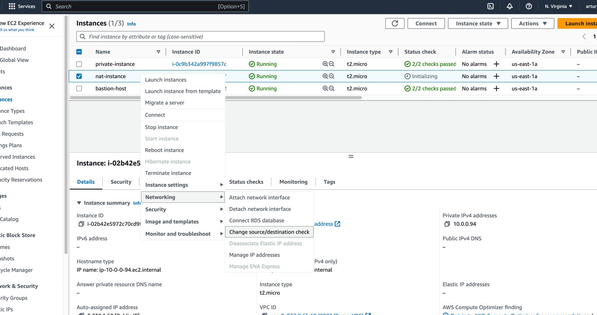
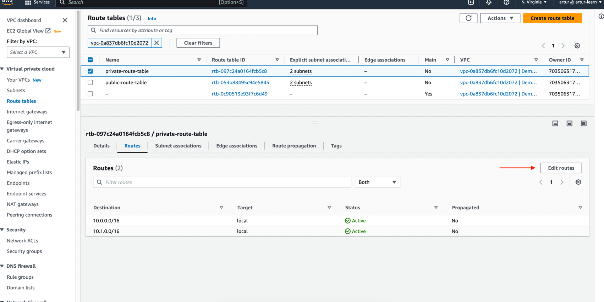
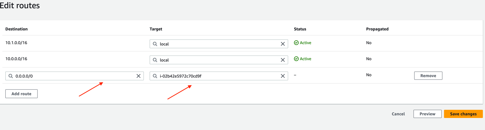

### NAT Instance (outdated, but still at the exam)

In Amazon Web Services (AWS), a NAT (Network Address Translation) instance is a specialized EC2 (Elastic Compute Cloud)
instance that is deployed within a Virtual Private Cloud (VPC) to enable instances in private subnets to initiate outbound
traffic to the internet while keeping their private IP addresses hidden. NAT instances play a crucial role in allowing
private instances to access external resources, such as downloading software updates, retrieving data from the internet,
or connecting to external APIs.

Here are some key points about NAT instances in AWS VPC:

1. Outbound Traffic: Private instances in a VPC reside in private subnets and do not have direct internet connectivity.
When a private instance needs to initiate outbound traffic to the internet, it sends its requests to the NAT instance.

2. Network Address Translation: The NAT instance performs Network Address Translation (NAT) by taking the outbound traffic
from private instances, changing the source IP address of the packets to its own public IP address, and forwarding them to
the internet.

3. Public IP Address: NAT instances have an Elastic IP address (a static, public IP address) associated with them. This
Elastic IP address is used as the source IP address for outbound traffic from private instances.

4. Security Group: NAT instances should have appropriate security group rules to allow inbound traffic on the necessary
ports (e.g., ports 80 and 443 for HTTP and HTTPS traffic).

5. Route Configuration: In the VPC's route table configuration, a specific route is added that directs all traffic with
a destination of 0.0.0.0/0 (i.e., all internet-bound traffic) to the NAT instance.

6. High Availability: For high availability and redundancy, it's recommended to deploy NAT instances in multiple availability
zones (AZs) within the VPC.

---

- NAT = Network Address Translation
- Allows EC2 instances in private subnets to connect to the Internet
- Must be launched in a public subnet
- Must disable EC2 setting: Source / destination Check
- Must have Elastic IP attached to it
- RouteTables must be configured to route traffic from private subnets to the NAT Instance

---

#### Picture how it works

---

#### Comments

- Pre-configured Amazon Linux AMI is available
  - Reached the end of standard support on December 31, 2020
- Not highly available / resilient setup out of the box
  - You need to create an ASG in multi-AZ + resilient user-data script
- Internet traffic bandwidth depends on EC2 instance type
- You must manage Security Groups & rules:
  - Inbound:
    - Allow HTTP / HTTPS traffic coming from Private Subnets
    - Allow SSH from your home network (access is provided through Internet Gateway)
  - Outbound:
    - Allow HTTP / HTTPS traffic to the Internet

---

#### How to use it

1. Create EC2 instance, but from image that provide NAT-instance

2. In EC2 instance we should create security group that allows SSH traffic and HTTP-HTTPS traffic from our VPC CIDR ip-addresses

3. Then, we need to disable 'Change Source / destination check'

4. Then, in 'private route table' we need to add route. Route must be: allow access to the internet but via NAT-instance
that we created previously. In 'destination' we should type all ip-address and in 'target' we should set NAT-instance.
It means we try to get access to the internet, this request will go to this NAT-instance.

5. Then, if we connect to our private EC2 instance (via bastion host for example), we will be able to send request to the
internet and receive response.

6. Note: If you try to send request from private instance via 'ping' command, it won't work, because we need specific port
to be able to make ping. We need in this NAT-instance in security group add specific protocol and allow access from our VPC
(on picture)

