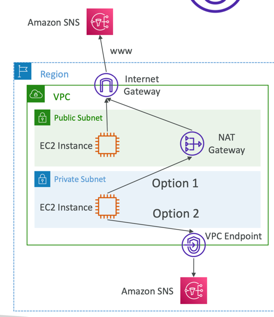
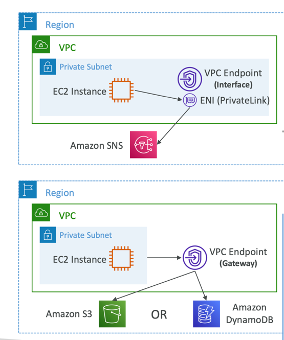
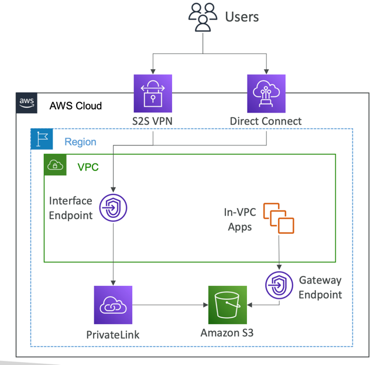

### VPC Endpoints

Amazon VPC (Virtual Private Cloud) endpoints are a type of network gateway in Amazon Web Services (AWS) that allows you to
connect your VPC directly to AWS services, such as Amazon S3, DynamoDB, and others, without requiring the traffic to traverse
the public internet. VPC endpoints enhance security, reduce data transfer costs, and improve network performance by enabling
private connectivity to AWS services.

- **Gateway Endpoints (S3 and DynamoDB)**:
  - **Gateway VPC Endpoint for Amazon S3**: This type of VPC endpoint allows your VPC to connect to Amazon S3 buckets within the same AWS region without going over the internet. It helps secure your S3 data and reduces data transfer costs.
  - **Gateway VPC Endpoint for DynamoDB**: Similar to the S3 endpoint, this allows private connectivity to DynamoDB tables in the same region, enhancing security and performance.
- Interface Endpoints:
  - Interface VPC Endpoints: These are used for accessing AWS services that are powered by AWS PrivateLink. Unlike the gateway endpoints, which are for specific services like S3 and DynamoDB, interface endpoints can be used for various AWS services, such as AWS Systems Manager, AWS CloudWatch, and AWS Elastic Load Balancing. They are powered by Network Load Balancers and provide secure, scalable, and highly available access to these services.

---

Key benefits of using VPC endpoints include:

- Improved Security: Traffic between your VPC and AWS services remains within the AWS network and is not exposed to the public internet. This enhances security and reduces the risk of data exposure.
- Reduced Data Transfer Costs: By using VPC endpoints, you can significantly reduce data transfer costs because data does not traverse the public internet. Data transferred between your VPC and the AWS service over the private network is often free.
- Network Performance: VPC endpoints provide low-latency, high-bandwidth connections to AWS services, improving overall network performance.
- Simplified Network Architecture: VPC endpoints eliminate the need for NAT gateways or VPN connections to access AWS services. This simplifies your network architecture.
- Private Connectivity: Your VPC can access AWS services privately, even if it does not have a Direct Connect or VPN connection to your on-premises data center.

VPC endpoints are a valuable tool for securing and optimizing your network connectivity to AWS services, particularly when dealing with sensitive data or compliance requirements.

---

### VPC Endpoints (AWS PrivateLink)

- Every AWS service is publicly exposed (public URL)
- VPC Endpoints (powered by AWS PrivateLink) allows you to connect to AWS services using a private network instead of using the public Internet
- They’re redundant and scale horizontally
- They remove the need of IGW, NATGW, ... to access AWS Services
- In case of issues:
  - Check DNS Setting Resolution in your VPC
  - Check Route Tables

--- 

### Types of Endpoints

- Interface Endpoints (powered by PrivateLink)
  - Provisions an ENI (private IP address) as an entry point (must attach a Security Group)
  - Supports most AWS services
  - $ per hour + $ per GB of data processed
- Gateway Endpoints
  - Provisions a gateway and must be used as a target in a route table (does not use security groups)
  - Supports both S3 and DynamoDB
  - Free

---

### Gateway or Interface Endpoint for S3?

- Gateway is most likely going to be preferred all the time at the exam
- Cost: free for Gateway, $ for interface endpoint
- Interface Endpoint is preferred access is required from on- premises (Site to Site VPN or Direct Connect), a different VPC or a different region

