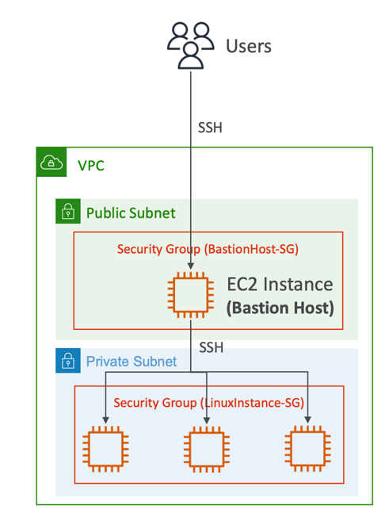

### Bastion Host

Example: we have EC2 instance in private subnet, but we as users, we are on our computer on the public internet. So, because
our EC2 instance in private subnet we don't have direct access to it. How we can get access to this EC2 instance?

We can use 'bastion host' (it's one of possible methods to get access to EC2 instance from that is in private subnet).

The bastion host is an EC2 instance, that's named bastion host that's named 'bastion host'. This EC2 instance is special because it is in public subnet. It has
own security group called the 'bastion host security group'. Then, we also have a security group for EC2 instance that is
in private subnet.

The idea is that the EC2 instance in the public subnet (bastion host) has access to the EC2 instance in private subnet,
because everything in our VPC.

To access EC2 instance int the private subnet, we do the first connect via SSH to the 'bastion host', then again via SSH 
from 'bastion host' to EC2 instance in private subnet. It could be one but it could be many EC2 instances as well

Summarize: 'bastion host' is a way for us to SSH into our private EC2 instances. 'Bastion host' in the public subnet. 

Security group for the 'bastion host' - it must allow access from the internet, but we should give access only for public
CIDR of your corporation, for example.

Security group for the EC2 instance - this instance must allow the SSH access from CIDR of your corporation or from security
group that we created for 'bastion host' 

