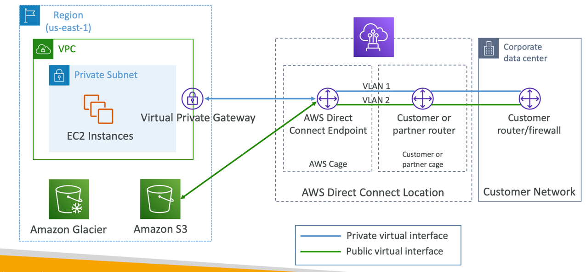
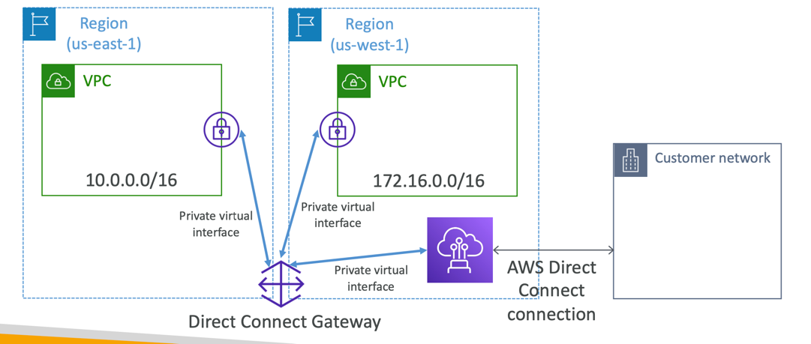
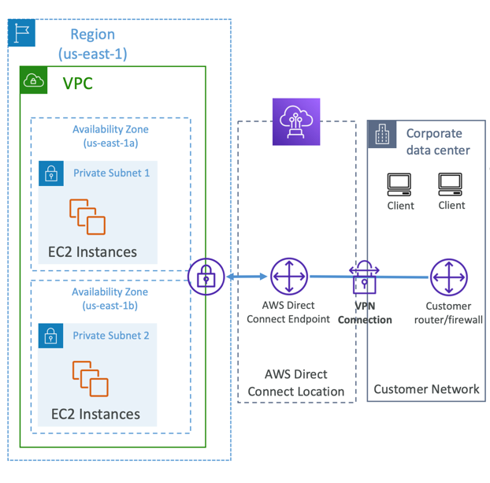

### Direct Connect (DX)

AWS Direct Connect (DX) is a network service provided by Amazon Web Services (AWS) that enables organizations to establish
dedicated and private network connections between their on-premises data centers or office locations and AWS data centers.
This service is designed to provide more predictable network performance, lower latency, and higher security compared to
using standard internet connections.

Key features and benefits of AWS Direct Connect include:

- Dedicated Network Connection: AWS Direct Connect provides dedicated and private network connections, which are separate from the public internet. This separation helps enhance security and reliability.
- Consistent Network Performance: With Direct Connect, organizations can achieve more predictable and consistent network performance compared to internet-based connections. This is essential for applications and workloads that require low latency and high bandwidth.
- Reduced Data Transfer Costs: Data transferred over Direct Connect is typically cheaper than data transferred over the public internet, making it cost-effective for organizations with large data transfer requirements.
- Private Connectivity to VPCs: Direct Connect allows organizations to establish private connectivity to their Amazon Virtual Private Clouds (VPCs). This enables seamless and secure communication between on-premises resources and resources within the VPC.
- Hybrid Cloud Connectivity: AWS Direct Connect is a critical component of hybrid cloud architectures, allowing organizations to extend their on-premises networks into the AWS cloud. This facilitates hybrid deployments, disaster recovery, and cloud bursting scenarios.
- Multiple Locations: AWS offers Direct Connect locations in various regions around the world. Organizations can choose the location that best suits their needs and establish connections to multiple AWS regions if necessary.
- Multiple Connection Speeds: Direct Connect offers various connection speed options, ranging from 1 Gbps to 100 Gbps, allowing organizations to select the appropriate bandwidth for their requirements.
- Redundancy and Failover: To ensure high availability and fault tolerance, organizations can set up redundant connections to multiple Direct Connect locations or AWS regions.
- Secure Connections: Direct Connect connections can be encrypted to enhance security. AWS also provides options for implementing additional security measures, such as Virtual LAN (VLAN) segmentation.

---

#### Direct Connect (DX)

- Provides a dedicated private connection from a remote network to your VPC
- Dedicated connection must be setup between your DC and AWS Direct Connect locations
- You need to setup aVirtual Private Gateway on yourVPC
- Access public resources (S3) and private (EC2) on same connection
- Use Cases:
  - Increase bandwidth throughput - working with large data sets – lower cost
  - More consistent network experience - applications using real-time data feeds
  - Hybrid Environments (on prem + cloud)
- Supports both IPv4 and IPv6

---

#### Direct Connect Diagram

--- 

#### Direct Connect Gateway

- If you want to setup a Direct Connect to one or more VPC in many different regions (same account), you must use a Direct Connect Gateway

---

#### Direct Connect – Connection Types

- Dedicated Connections: 1Gbps,10 Gbps and 100 Gbps capacity
  - Physical ethernet port dedicated to a customer
  - Request made to AWS first, then completed by AWS Direct Connect Partners
- Hosted Connections: 50Mbps, 500 Mbps, to 10 Gbps
  - Connection requests are made via AWS Direct Connect Partners
  - Capacity can be added or removed on demand
  - 1, 2, 5, 10 Gbps available at select AWS Direct Connect Partners
- Lead times are often longer than 1 month to establish a new connection

---

#### Direct Connect – Encryption

- Data in transit is not encrypted but is private
- AWS Direct Connect + VPN provides an IPsec-encrypted private connection
- Good for an extra level of security, but slightly more complex to put in place

---

#### Direct Connect - Resiliency

