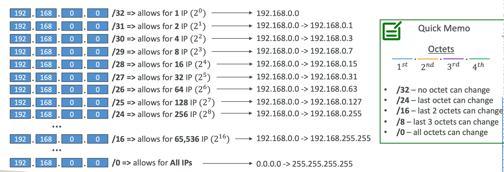
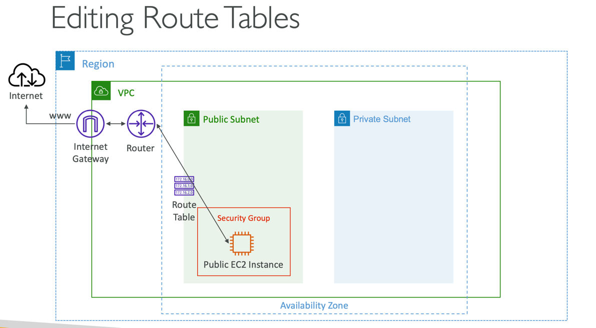

### Understanding CIDR – IPv4

- Classless Inter-Domain Routing – a method for allocating IP addresses
- Used in Security Groups rules and AWS networking in general

- They help to define an IP address range:
  - We’ve seen WW.XX.YY.ZZ/32 => one IP
  - We’ve seen 0.0.0.0/0 => all IPs
  - But we can define:192.168.0.0/26 =>192.168.0.0 – 192.168.0.63 (64 IP addresses)

---

- A CIDR consists of two components
- Base IP
  - Represents an IP contained in the range (XX.XX.XX.XX)
  - Example:10.0.0.0,192.168.0.0,...
- Subnet Mask
  - Defines how many bits can change in the IP
  - Example:/0,/24,/32
  - Can take two forms:
    - /8 -> 255.0.0.0
    - /16 -> 255.255.0.0
    - /24 -> 255.255.255.0
    - /32 -> 255.255.255.255

---

- The Subnet Mask basically allows part of the underlying IP to get additional next values from the base IP

- When in doubt, use this website https://www.ipaddressguide.com/cidr

---

### Public vs. Private IP (IPv4)

- The Internet Assigned Numbers Authority (IANA) established certain blocks of IPv4 addresses for the use of private (LAN) and public (Internet) addresses
- Private IP can only allow certain values:
  - 10.0.0.0 – 10.255.255.255 (10.0.0.0/8) <- in big networks
  - 172.16.0.0 – 172.31.255.255 (172.16.0.0/12) <- AWS defaultVPC in that range
  - 192.168.0.0 – 192.168.255.255 (192.168.0.0/16) <- e.g., home networks
- All the rest of the IP addresses on the Internet are Public

---

### Default VPC Walkthrough

- All new AWS accounts have a default VPC
- New EC2 instances are launched into the default VPC if no subnet is specified
- Default VPC has Internet connectivity and all EC2 instances inside it have public IPv4 addresses
- We also get a public and a private IPv4 DNS names

---

### VPC in AWS – IPv4

- VPC =Virtual Private Cloud
- You can have multiple VPCs in an AWS region (max. 5 per region – soft limit)
- Max. CIDR per VPC is 5, for each CIDR:
  - Min. size is /28 (16 IP addresses)
  - Max. size is /16 (65536 IP addresses)
- Because VPC is private, only the Private IPv4 ranges are allowed:
  - 10.0.0.0 – 10.255.255.255 (10.0.0.0/8)
  - 172.16.0.0 – 172.31.255.255 (172.16.0.0/12)
  - 192.168.0.0 – 192.168.255.255 (192.168.0.0/16)
- Your VPC CIDR should NOT overlap with your other networks (e.g., corporate)

---

### VPC – Subnet (IPv4)

Subnet is sub-range of IPv4 addresses within your VPC.

- AWS reserves 5 IP addresses (first 4 & last 1) in each subnet
- These 5 IP addresses are not available for use and can’t be assigned to an EC2 instance
- Example: if CIDR block 10.0.0.0/24, then reserved IP addresses are:
  - 10.0.0.0 – Network Address
  - 10.0.0.1 – reserved ved by AWS for the VPC router
  - 10.0.0.2 – reserved by AWS for mapping to Amazon-provided DNS
  - 10.0.0.3 – reserved by AWS for future use
  - 10.0.0.255 – Network Broadcast Address.AWS does not support broadcast in aVPC, therefore the address is reserved
- Exam Tip, if you need 29 IP addresses for EC2 instances:
  - You can’t choose a subnet of size /27 (32 IP addresses, 32 – 5 = 27 < 29)
  - You need to choose a subnet of size /26 (64 IP addresses, 64 – 5 = 59 > 29)

---

### Internet Gateway (IGW)

- Allows resources (e.g., EC2 instances) in a VPC connect to the Internet
- It scales horizontally and is highly available and redundant
- Must be created separately from a VPC
- One VPC can only be attached to one IGW and vice versa
- Internet Gateways on their own do not allow Internet access... 
- Route tables must also be edited!

---
