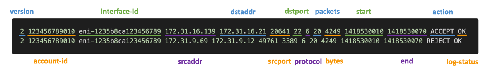
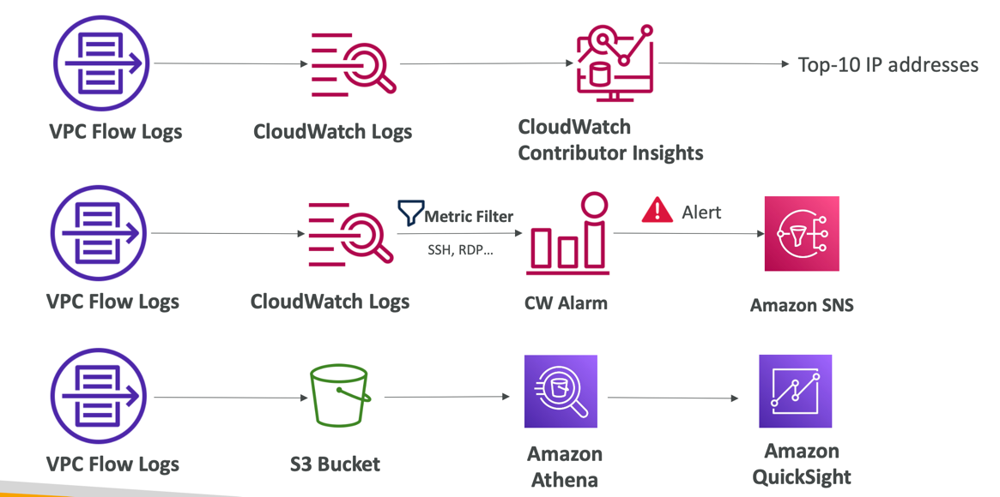

### VPC Flow Logs

- Capture information about IP traffic going into your interfaces:
  - VPC Flow Logs
  - Subnet Flow Logs
  - Elastic Network Interface (ENI) Flow Logs
- Helps to monitor & troubleshoot connectivity issues
- Flow logs data can go to S3, CloudWatch Logs, and Kinesis Data Firehose
- Captures network information from AWS managed interfaces too: ELB, RDS, ElastiCache, Redshift,WorkSpaces, NATGW,Transit Gateway...

---

### VPC Flow Logs Syntax

- srcaddr & dstaddr – help identify problematic IP
- srcport & dstport – help identity problematic ports
- Action – success or failure of the request due to Security Group / NACL
- Can be used for analytics on usage patterns, or malicious behavior
- Quer y VPC flow logs using Athena on S3 or CloudWatch Logs Insights
- Flow Logs examples: https://docs.aws.amazon.com/vpc/latest/userguide/flow-logs-records-examples.html

---

### VPC Flow Logs – Troubleshoot SG & NACL issues

#### Look at the “ACTION” field

Incoming Requests
- Inbound REJECT => NACL or SG
- Inbound ACCEPT,Outbound REJECT => NACL

Outgoing Requests
- Outbound REJECT => NACL or SG
- Outbound ACCEPT,Inbound REJECT => NACL

---

### VPC Flow Logs – Architectures

