### VPC Peering

VPC peering, or Virtual Private Cloud peering, is a networking connection between two Virtual Private Clouds (VPCs) in Amazon
Web Services (AWS). It allows these VPCs to communicate with each other as if they were on the same network, even if they
are in different AWS accounts or different AWS regions. Here are some key points about VPC peering:

1) **Private Network Connectivity**: VPC peering enables private IP connectivity between VPCs. Traffic between the peered VPCs
remains within the AWS network and does not traverse the public internet.
2) **No Overlapping CIDR Blocks**: The IP address ranges (CIDR blocks) of the peered VPCs must not overlap. Overlapping CIDR
blocks are not allowed.
3) **Transitive Peering**: VPC peering connections are not transitive. If VPC A is peered with VPC B and VPC B is peered with
VPC C, VPC A does not have a direct peering relationship with VPC C. You would need to create a separate peering connection
between VPC A and VPC C to enable communication.
4) **Security Group and NACLs**: Network security groups (NSGs) and network access control lists (NACLs) in each VPC can control
traffic in and out of the peering connection, just like they would for traffic within the same VPC.
5) **Routing**: The route tables in each VPC must be configured to route traffic to the CIDR block of the peered VPC. AWS
automatically updates the route tables when you create the peering connection.
6) **Cross-Account Peering**: VPC peering can be established between VPCs in the same AWS account or different AWS accounts,
provided that both parties agree to the peering request.
7) **Cross-Region Peering**: You can also establish VPC peering connections across different AWS regions, allowing for global
network connectivity.
8) **Data Transfer Costs**: Data transferred between peered VPCs within the same AWS region is typically free. However, data
transfer costs may apply for cross-region VPC peering.

VPC peering is a powerful feature that allows you to build complex network architectures, share resources, and facilitate
communication between different VPCs while maintaining network isolation and security. It's commonly used in scenarios where
you want to segment workloads, share resources like databases, or establish connectivity between different environments
(e.g., development and production).

---

### VPC Peering

- Privately connect two VPCs using AWS’ network
- Make them behave as if they were in the same network
- Must not have overlapping CIDRs
- VPC Peering connection is NOT transitive
(must be established for each VPC that need to communicate with one another)
- You must update route tables in each VPC’s subnets to ensure EC2 instances can communicate with each other

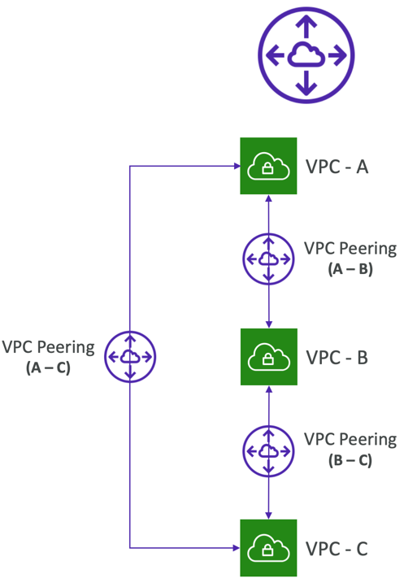

---

### VPC Peering – Good to know

- You can create VPC Peering connection between VPCs in different AWS accounts/regions
- You can reference a security group in a peeredVPC (works cross accounts – same region)

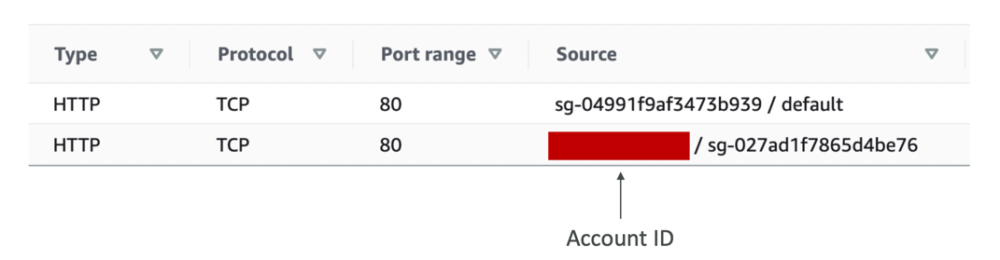

---

### VPC Peering

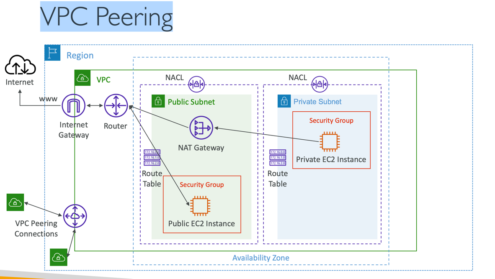

---

### How To Create

1) Create peering connections 

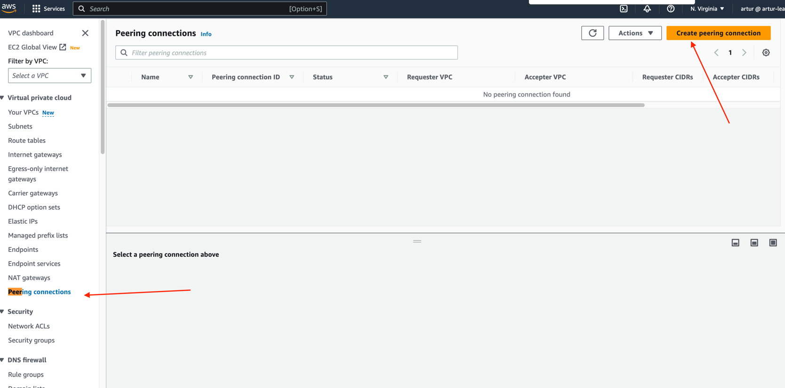

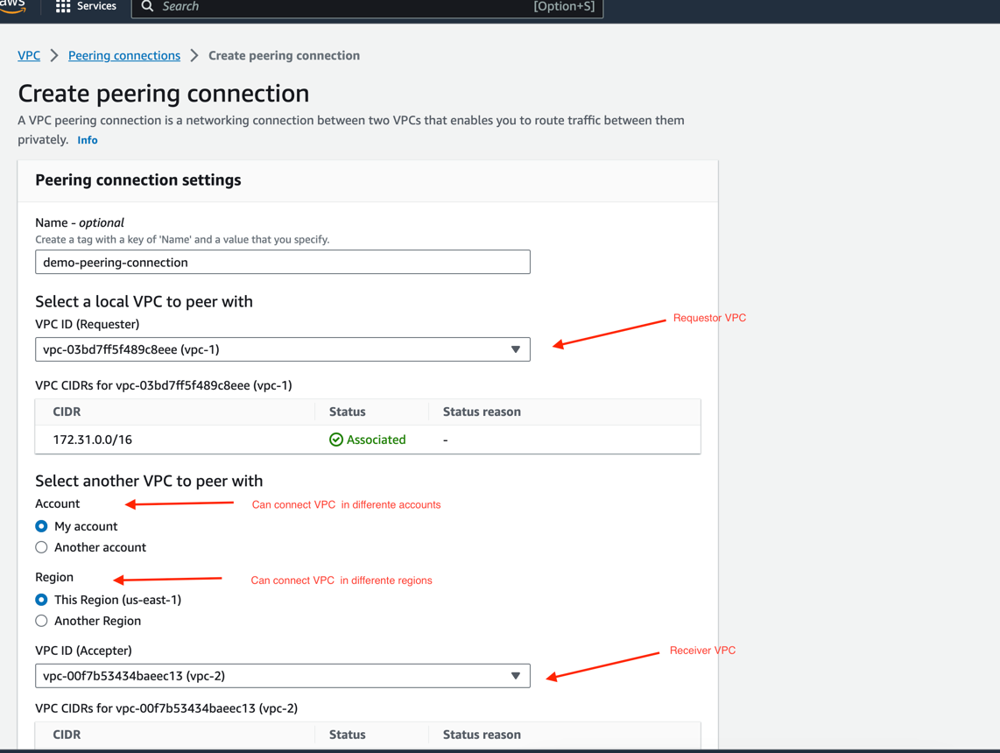

2) Pending acceptance, means that we must accept this peering. In this case we have both peering in the same account, so
we can just accept this peering

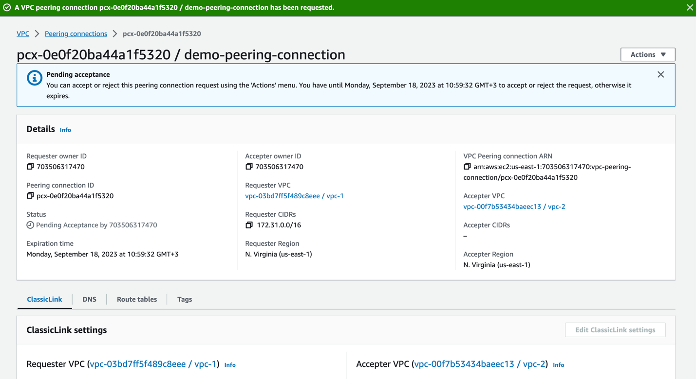

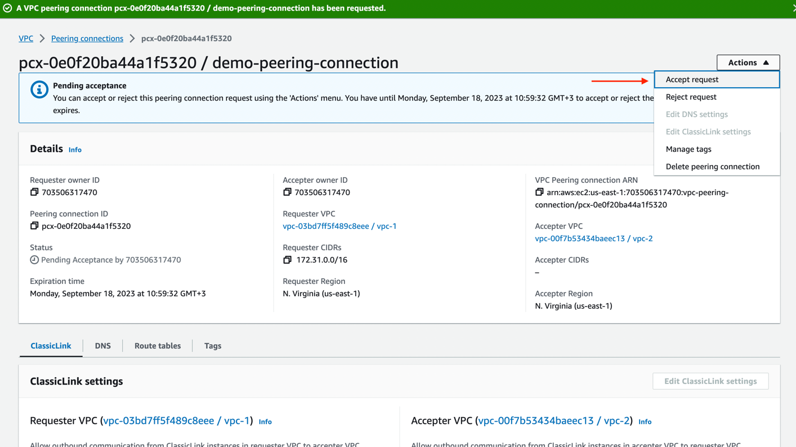

3) Then, we need to modify route table to accept peering connection

3.1) We need to connect these 2 route tables

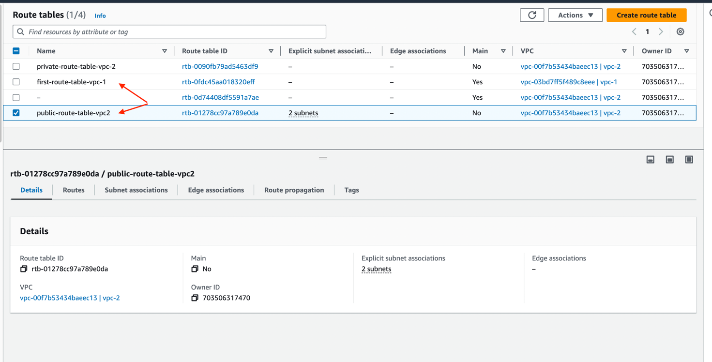

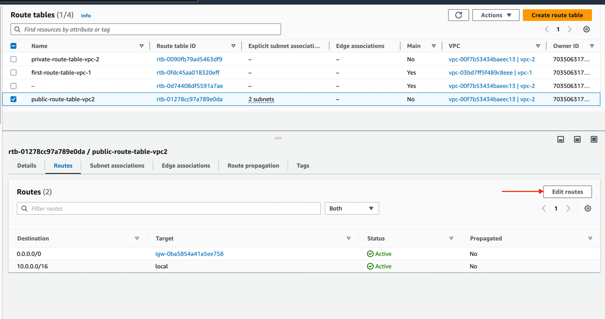

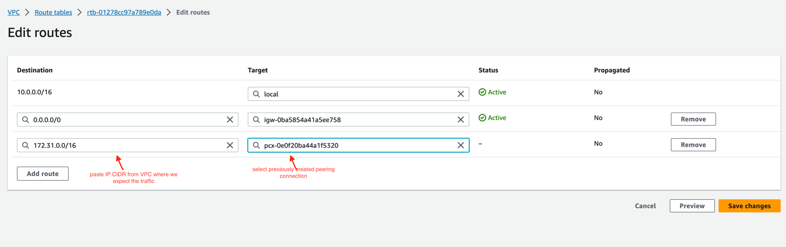

3.2) Then, we need to make the same actions, but for 'first route table' (like we need to modify route table in both ways)

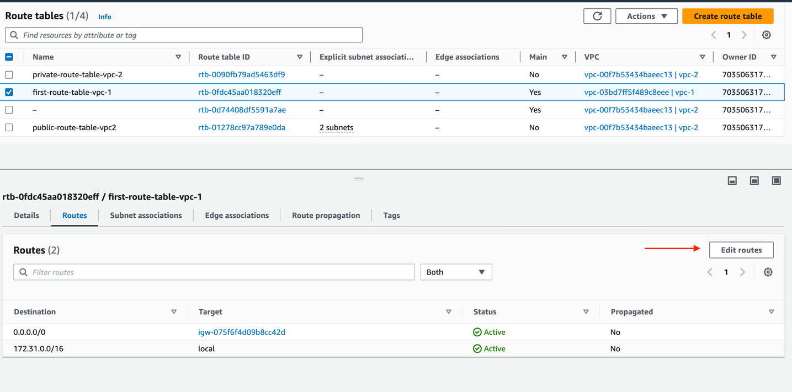

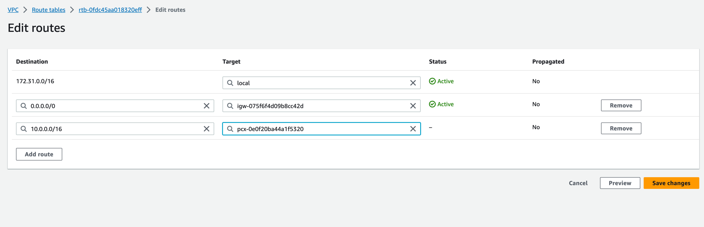