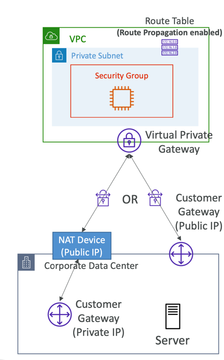
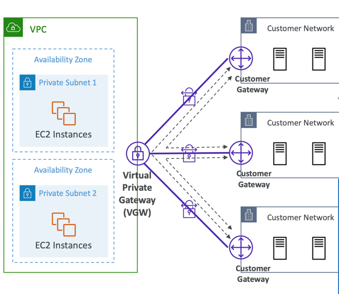

### AWS Site-to-Site VPN

A Site-to-Site VPN (Virtual Private Network) in AWS refers to a type of VPN connection that allows secure communication
between your on-premises data center or network and your Virtual Private Cloud (VPC) in AWS. It establishes a secure and
encrypted connection over the public internet, enabling your on-premises resources to securely communicate with resources
hosted in AWS.

site-to-site VPN consist of 2 things:
- Virtual Private Gateway (VGW)
  - VPN concentrator on the AWS side of the VPN connection
  - VGW is created and attached to the VPC from which you want to create the Site-to-Site VPN connection
  - Possibility to customize the ASN (Autonomous System Number)
- Customer Gateway (CGW)
  - Software application or physical device on customer side of the VPN connection
  - https://docs.aws.amazon.com/vpn/latest/s2svpn/your-cgw.html#DevicesTested

---

#### Site-to-Site VPN Connections

- Customer Gateway Device (On-premises)
  - What IP address to use?
    - Public Internet-routable IP address for your Customer Gateway device
    - If it’s behind a NAT device that’s enabled for NAT traversal (NAT-T), use the public IP address of the NAT device
- Important step: enable Route Propagation for theVirtual Private Gateway in the route table that is associated with your subnets
- If you need to ping your EC2 instances from on-premises, make sure you add the ICMP protocol on the inbound of your security groups

--- 

#### AWS VPN CloudHub

- Provide secure communication between multiple sites, if you have multiple VPN connections
- Low-cost hub-and-spoke model for primary or secondary network connectivity between different locations (VPN only)
- It’s a VPN connection so it goes over the public Internet
- To set it up, connect multiple VPN connections on the same VGW, setup dynamic routing and configure route tables

