### Example how to create VPC and EC2 and give access EC2 to the internet within VPC

1. Create VPC

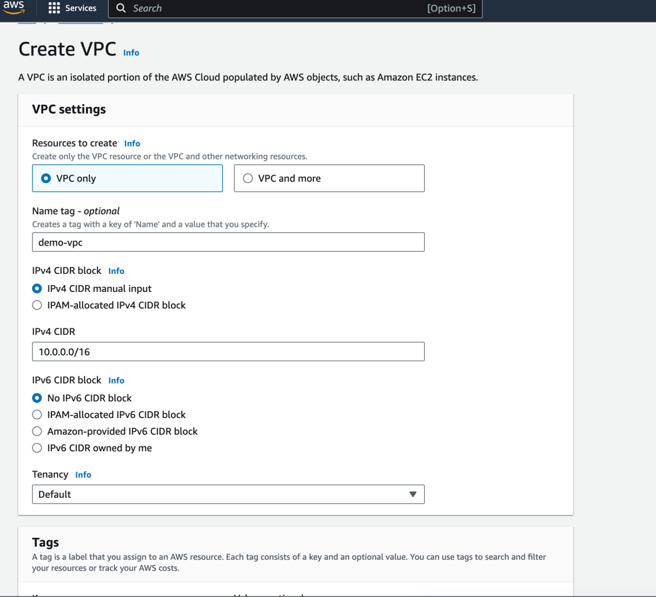

2. Create subnet. Subnet we bind to previously created VPC and bind to AZ (for example us-east-1a). Is it good practice
   to create public and private subnets for AZ  

2.1. create public subnet (in subnet us-east-1a)  
2.2. create private subnet (in subnet us-east-1a)

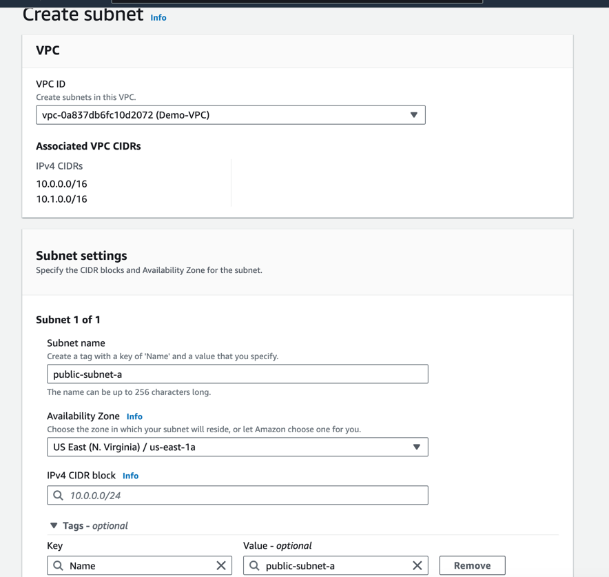

3. Then, in 'public' subnets need to enable 'Enable auto-assign public IPv4 address', it allows access to the internet.

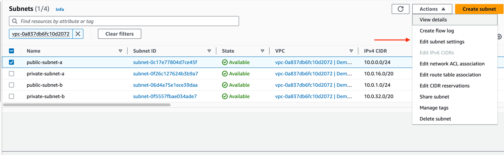

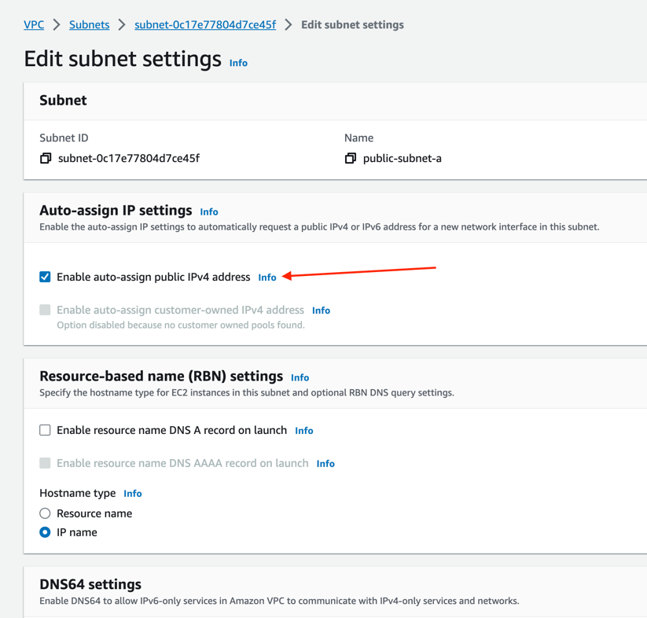

4. Then, we need to create 'internet gateway' and attach to previously created VPC

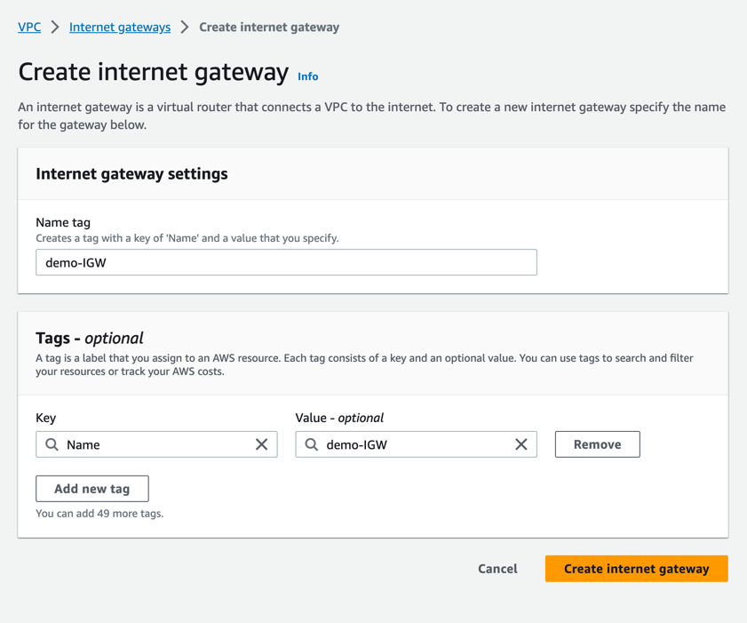

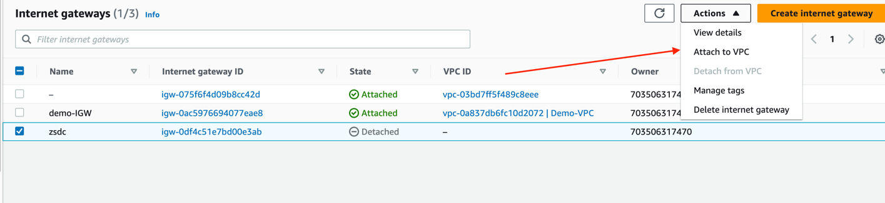

5. Then, we need to create 'route table'. It's good to create route table for public and private subnets separate

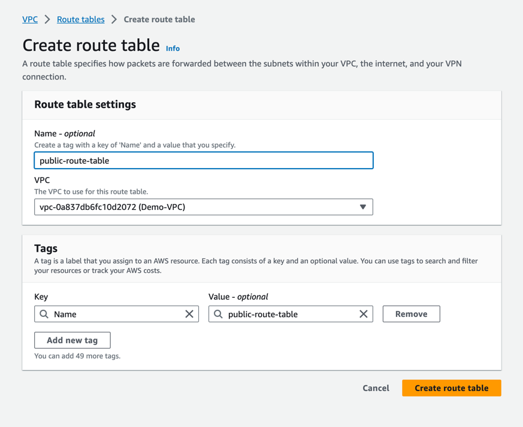

5.1. Then, we need to assign subnets to this route table

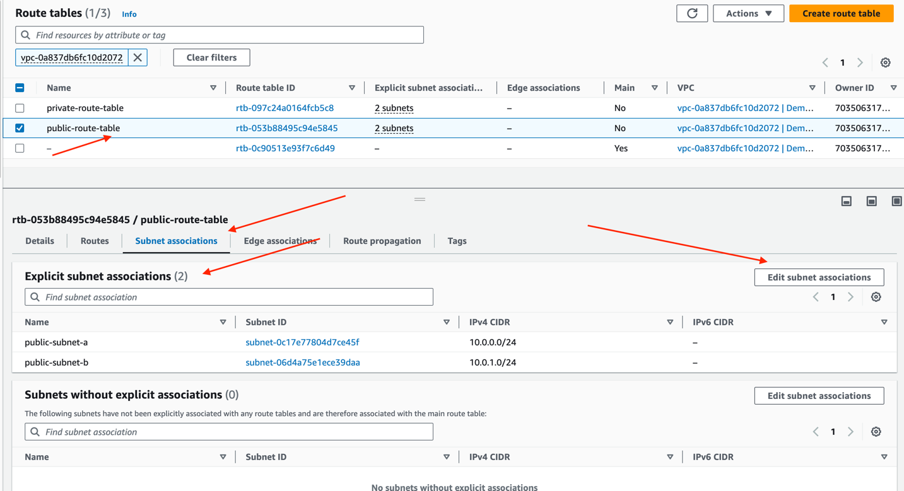

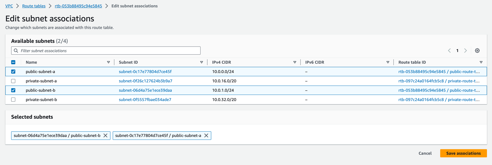

5.2. Then, we need to add route to 'public route table' that allows traffic to the internet

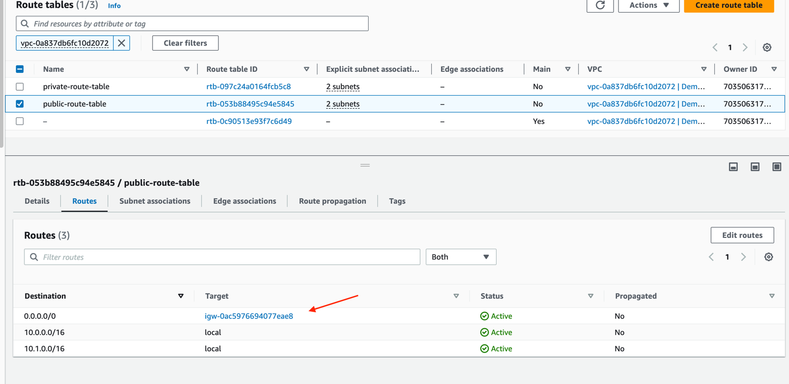

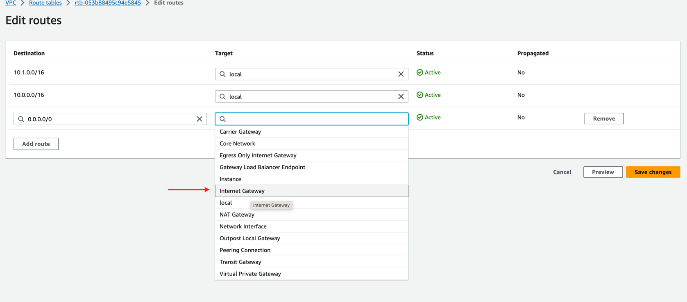

5.3. In 'target' assign internet gateway that we previously created

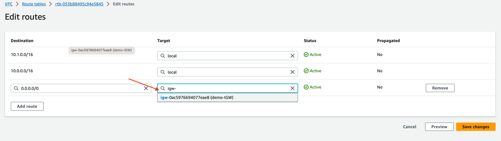

6. Then, we can create EC2 instance and VPC that we created, and this EC2 will have access to the internet

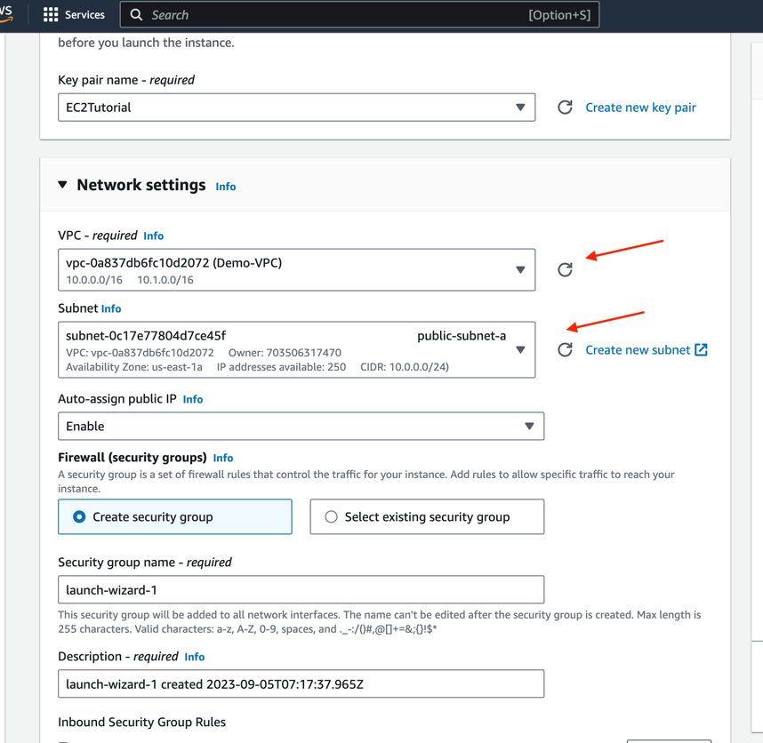